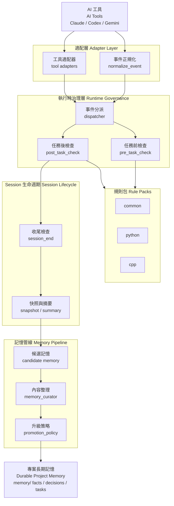
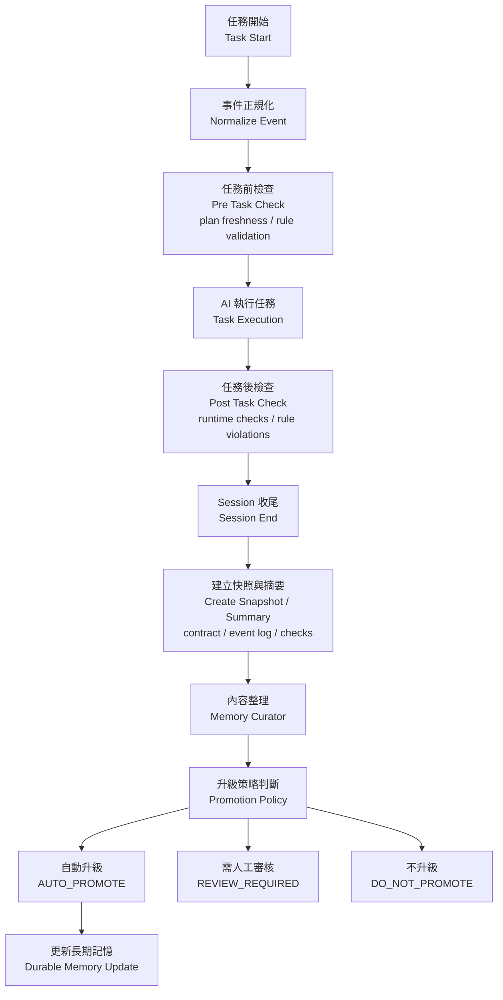

# AI Governance Framework

> 從「叫 AI 幫忙寫程式」進化到「讓 AI 在治理框架內工作」。

[](https://opensource.org/licenses/MIT)
[](https://github.com/GavinWu672/ai-governance-framework)
[](http://makeapullrequest.com)

## 這是什麼

AI 在長期專案裡常見的問題不是單次回答不夠聰明，而是：

- 逐漸忘記上下文
- 偏離目前 sprint 或 phase
- 破壞架構邊界
- 任務做完後沒有留下可審核的知識

這個 repo 提供一套治理文件、驗證工具與 runtime hooks，讓 AI coding workflow 從：

`AI -> code -> human review`

變成：

`AI -> runtime governance -> task execution -> session lifecycle -> memory governance`

目前更精確的定位是：

- 一個可運行的 `AI Coding Runtime Governance Framework prototype`
- 具備完整的 runtime governance spine，而不是只有靜態 policy 文件
- 已建立 external domain validator seam，並已跑通第一個 firmware domain vertical slice
- 仍在持續補強 semantic verification、workflow embedding 與 interception coverage

## 核心能力

### 1. 治理憲法

`governance/` 目錄定義了 AI 在專案中的角色、邊界與停止條件：

- `SYSTEM_PROMPT.md`
- `HUMAN-OVERSIGHT.md`
- `AGENT.md`
- `ARCHITECTURE.md`
- `REVIEW_CRITERIA.md`
- `TESTING.md`
- `NATIVE-INTEROP.md`
- `PLAN.md`

另外，`.github/` 現在也提供前置互動層：

- `copilot-instructions.md` 作為 repo-wide baseline
- `.github/agents/*.agent.md` 作為角色定義
- `.github/skills/*/skill.md` 作為行為型 skill policy

### 2. 靜態治理工具

`governance_tools/` 目前包含：

- `contract_validator.py`
- `plan_freshness.py`
- `memory_janitor.py`
- `state_generator.py`
- `rule_pack_loader.py`
- `test_result_ingestor.py`
- `failure_test_validator.py`
- `failure_completeness_validator.py`
- `public_api_diff_checker.py`
- `driver_evidence_validator.py`
- `rule_pack_suggester.py`
- `architecture_drift_checker.py`
- `governance_auditor.py`
- `change_proposal_builder.py`
- `change_control_summary.py`

### 3. Runtime Governance

`runtime_hooks/` 目前已支援：

- shared event contract
- dispatcher
- `session_start`
- `pre_task_check`
- `post_task_check`
- `session_end`
- Claude Code / Codex / Gemini adapters
- `session_start -> pre_task_check -> post_task_check -> session_end -> memory pipeline`

這條 runtime governance loop 已經形成，但目前 interception coverage 尚未完全封閉，仍有部分 IDE / local edit / direct commit path 可能繞過。

### 4. Memory Pipeline

`memory_pipeline/` 目前已支援：

- `session_snapshot.py`
- `memory_curator.py`
- `promotion_policy.py`
- `memory_promoter.py`

### 5. Rule Packs

目前已內建的 rule packs：

Scope packs:

- `common`
- `refactor`

Language packs:

- `python`
- `cpp`
- `csharp`
- `swift`

Framework packs:

- `avalonia`

Platform packs:

- `kernel-driver`

其中：

- `cpp` 已包含 build-boundary 規則，例如禁止跨專案 private include 與錯誤使用 `AdditionalIncludeDirectories`
- `csharp` 聚焦 thread / native boundary
- `avalonia` 聚焦 UI thread 與 ViewModel boundary
- `swift` 聚焦 concurrency 與 native interop boundary
- `kernel-driver` 聚焦 IRQL、memory boundary、cleanup / unwind 等高權限風險
- `kernel-driver` 證據應優先來自 SDV / SAL / WDK 類分析結果與 driver-focused tests，而不是自製全能 parser
- Rule packs 目前比較接近 policy activation layer，而不是完整 policy engine
- `test_result_ingestor.py` 現在除了 `pytest-text` / `junit-xml`，也可正規化 `sdv-text`、`msbuild-warning-text`、`sarif`、`wdk-analysis-text`
- `architecture_drift_checker.py` 現在除了 high-signal heuristic，也支援 before/after dependency edge diff
- `state_generator.py` 現在會附帶 advisory `rule_pack_suggestions`，但不會自動改寫 `runtime_contract.rules`
- `pre_task_check.py` 現在也會暴露同樣的 advisory suggestions，讓 runtime 入口與 state view 對齊
- 當高信心 language/framework suggestion 未被載入時，`pre_task_check.py` 會給 advisory warning，但不會自動改 contract
- `rule_pack_suggester.py` / `state_generator.py` / `pre_task_check.py` 現在都會提供 `suggested_rules_preview`，方便直接採用建議規則串
- `rule_pack_suggester.py` / `state_generator.py` / `pre_task_check.py` 現在也會提供 advisory `suggested_skills` 與 `suggested_agent`
- `pre_task_check --format human` 現在也會直接印出 `suggested_rules_preview=...`
  - 同時也會直接印出 `suggested_skills=...` 與 `suggested_agent=...`
- `pre_task_check.py` / `state_generator.py` 現在都可附帶 `architecture_impact_preview`
  - 當 proposal 顯示風險高於目前 contract 時，只會給 advisory warning，不會自動改 `RULES` / `RISK` / `OVERSIGHT`
  - 兩者現在也會補出 proposal guidance，例如 `expected_validators` / `required_evidence`
- `pre_task_check --format human` 現在也會直接印出 `impact_validators=...` 與 `impact_evidence=...`
- `session_end.py` / `memory_curator.py` 現在也會保留 `architecture_impact_preview`
  - proposal-time concerns 與 expected evidence 會進 summary / curated artifacts，形成 audit trail
- `session_end.py` / `memory_curator.py` 現在也會保留 `proposal_summary`
  - proposal-time risk / oversight 建議、concerns、required evidence 會進 summary / curated artifacts
- `post_task_check --format human` 現在也會直接印出 evidence summary，例如 `public_api_ok=...`、`failure_completeness_ok=...`
- `architecture_impact_estimator.py` 現在可在 proposal 階段輸出結構化 `Governance Impact Report`
  - path-based layer heuristics (`touched_layers`, `boundary_risk`)
  - evidence forecaster (`expected_validators`, `required_evidence`)
  - impact signals (`concerns`, `recommended_risk`, `recommended_oversight`)
  - 只做 advisory impact estimation，不直接替代治理裁決

### 6. External Domain Seam

目前已支援外部 domain extension seam：

- `contract.yaml` discovery
- external rule roots
- validator preflight
- advisory validator execution

第一個 vertical slice 是 `examples/usb-hub-contract/`，目前已可：

- 載入 firmware domain documents 與 behavior overrides
- 啟用外部 `hub-firmware` rule pack
- 執行 `interrupt_safety_validator.py`
- 從 `diff_text`、unified diff、changed source files、以及 file-based `checks-file` / `diff_file` evidence 推導 interrupt context

## 本機執行需求

本 repo 的治理工具與 runtime hooks 需要 Python 3.9+。

若 `python` / `python3` / `py -3` 不在 `PATH`，可先指定：

```bash
export AI_GOVERNANCE_PYTHON=/path/to/python
```

Windows PowerShell:

```powershell
$env:AI_GOVERNANCE_PYTHON='C:\Path\To\python.exe'
```

`scripts/run-runtime-governance.sh`、`scripts/verify_phase_gates.sh`、以及安裝後的 git hooks 都會優先使用這個變數。

範例：

```text
RULES = common,csharp,avalonia,refactor
```

- `common`: 全域治理基線
- `csharp`: 語言層邊界與 threading / native contract
- `avalonia`: UI / Dispatcher / ViewModel 邊界
- `refactor`: 變更型別治理，要求 behavior lock 與 boundary safety
  並逐步要求 interface stability、regression evidence、cleanup / rollback evidence

高風險平台例子：

```text
RULES = common,cpp,kernel-driver,refactor
RISK = high
OVERSIGHT = human-approval
MEMORY_MODE = candidate
```

## 執行時治理總覽

核心 Governance Contract 欄位：

```text
RULES       = <comma-separated rule packs>
RISK        = <low|medium|high>
OVERSIGHT   = <auto|review-required|human-approval>
MEMORY_MODE = <stateless|candidate|durable>
```

### 架構總覽 (Runtime Architecture)



### 任務治理流程 (Runtime Flow)



## 快速開始

### 最小可用版

如果你要先把治理框架帶進現有專案，最簡單的路徑是：

```bash
git clone https://github.com/GavinWu672/ai-governance-framework.git
cd ai-governance-framework

./deploy_to_memory.sh /path/to/your/project
```

或手動複製：

```bash
cp -r governance /path/to/your/project/
cp -r governance_tools /path/to/your/project/
```

建議至少準備：

- `governance/`
- `PLAN.md`
- `memory/`

之後在新對話或新 agent 啟動時，先要求它：

```text
請先完整閱讀 governance/SYSTEM_PROMPT.md，
並依照 §2 初始化流程執行，完成後回報 [Governance Contract]。
```

### 範例專案

可參考：

- `examples/starter-pack/`
- `examples/todo-app-demo/`
- `examples/chaos-demo/`

## 常用入口

### 靜態治理工具

```bash
python governance_tools/contract_validator.py --file ai_response.txt
python governance_tools/plan_freshness.py --plan PLAN.md
python governance_tools/state_generator.py --rules common,python,cpp --risk medium --oversight review-required --memory-mode candidate
python governance_tools/state_generator.py --rules common,refactor --impact-before before.cs --impact-after after.cs --format json
python governance_tools/memory_janitor.py --memory-root ./memory --check
python governance_tools/failure_test_validator.py --file test_names.json --format json
python governance_tools/failure_completeness_validator.py --file checks.json --format json
python governance_tools/public_api_diff_checker.py --before before.cs --after after.cs --format json
python governance_tools/architecture_impact_estimator.py --before before.cs --after after.cs --rules common,refactor --scope refactor --format human
python governance_tools/change_proposal_builder.py --project-root . --task-text "Refactor Avalonia boundary" --rules common,refactor --impact-before before.cs --impact-after after.cs --format human
python governance_tools/change_control_summary.py --session-start-file session_start.json --session-end-file session_end_summary.json --format human
python governance_tools/driver_evidence_validator.py --file checks.json --format json
python governance_tools/refactor_evidence_validator.py --file checks.json --format json
python governance_tools/rule_pack_suggester.py --project-root . --task "Refactor Avalonia view model boundary"
python governance_tools/governance_auditor.py --format json
```

### Runtime Hooks

```bash
python runtime_hooks/core/pre_task_check.py --rules common,python,cpp --risk high --oversight review-required
python runtime_hooks/core/session_start.py --project-root . --plan PLAN.md --rules common,refactor --task-text "Refactor Avalonia boundary" --impact-before before.cs --impact-after after.cs
python runtime_hooks/smoke_test.py --event-type session_start
python runtime_hooks/core/pre_task_check.py --rules common,refactor --risk medium --oversight review-required --impact-before before.cs --impact-after after.cs
python runtime_hooks/core/post_task_check.py --file ai_response.txt --risk medium --oversight review-required --checks-file checks.json --api-before before.cs --api-after after.cs
python runtime_hooks/dispatcher.py --file shared_event.json
python runtime_hooks/core/session_end.py --project-root . --session-id 2026-03-12-01 --runtime-contract-file contract.json --checks-file checks.json --impact-preview-file impact.json --proposal-summary-file proposal_summary.json --event-log-file event_log.json --response-file ai_response.txt
```

Kernel-driver evidence flow:

```text
SDV / SAL / WDK diagnostics
        ↓
normalized checks payload
        ↓
driver_evidence_validator.py
        ↓
post_task_check.py
```

Public API diff audit flow:

```text
public_api_diff_checker.py
        ↓
post_task_check.py
        ↓
session_end summary / curated artifact
```

Architecture impact audit flow:

```text
architecture_impact_estimator.py
        ↓
pre_task_check.py / state_generator.py
        ↓
session_end summary / curated artifact
```

Change proposal flow:

```text
task text + project signals + impact files
        ↓
change_proposal_builder.py
        ↓
suggested rules + proposal guidance + impact preview + proposal_summary
```

Session-start handoff flow:

```text
state_generator.py + pre_task_check.py + change_proposal_builder.py
        ↓
session_start.py
        ↓
agent start context + proposal_summary
```

Session-end audit flow:

```text
proposal_summary + runtime checks + impact preview
        ↓
session_end.py
        ↓
summary artifact + curated artifact
```

Change-control summary flow:

```text
session_start context + session_end summary
        ↓
change_control_summary.py
        ↓
reviewable change-control summary
```

`change_control_summary.py --format human` 現在會先輸出一行 reviewer-first summary，再列 proposal / runtime 區塊細節。

### Adapters

```bash
python runtime_hooks/adapters/claude_code/normalize_event.py --event-type pre_task --file claude_event.json
python runtime_hooks/adapters/codex/normalize_event.py --event-type post_task --file codex_event.json
python runtime_hooks/adapters/gemini/normalize_event.py --event-type pre_task --file gemini_event.json
```

### Memory Pipeline

```bash
python memory_pipeline/session_snapshot.py --memory-root memory --task "Runtime governance" --summary "Captured a candidate snapshot"
python memory_pipeline/memory_curator.py --candidate-file artifacts/runtime/candidates/<session_id>.json --output artifacts/runtime/curated/<session_id>.json
python memory_pipeline/memory_promoter.py --memory-root memory --candidate-file memory/candidates/session_*.json --approved-by reviewer-01
```

### Smoke Test

```bash
python runtime_hooks/smoke_test.py --harness claude_code --event-type pre_task
python runtime_hooks/smoke_test.py --harness claude_code --event-type session_start
python runtime_hooks/smoke_test.py --harness codex --event-type post_task
python runtime_hooks/smoke_test.py --harness codex --event-type session_start
python runtime_hooks/smoke_test.py --harness gemini --event-type post_task
python runtime_hooks/smoke_test.py --harness gemini --event-type session_start
python runtime_hooks/smoke_test.py --event-type session_start
```

`session_start` smoke 的 human output 現在會直接顯示 startup handoff summary，例如目前 contract、expected validators、required evidence。
shared enforcement 現在也會同時保留：
- `*_session_start.txt` handoff notes
- `*_session_start.json` machine-readable startup envelopes
- `*_change_control_summary.txt` proposal-to-startup review summaries
- `INDEX.txt` change-control artifact index
其中 `*_session_start.json` 可直接作為 `change_control_summary.py --session-start-file ...` 的輸入。

### Shared Enforcement

```bash
bash scripts/run-runtime-governance.sh --mode enforce
```

## 多工具支援

目前 runtime layer 已支援多種 AI 工具：

- Claude Code
- Codex
- Gemini

這些工具都會先把 native payload 正規化成同一個 shared event contract，再進入 governance checks。

`session_start` 目前先作為 shared governance event 存在，用於 agent 啟動與 handoff context；native harness adapters 可後續再接。
現在 shared adapter runner 也已能處理 `session_start`，至少可用 shared/native examples 走通啟動鏈。

相關檔案：

- `runtime_hooks/event_contract.md`
- `runtime_hooks/event_schema.json`
- `runtime_hooks/examples/shared/`
- `runtime_hooks/examples/claude_code/`
- `runtime_hooks/examples/codex/`
- `runtime_hooks/examples/gemini/`

## CI 與驗證

GitHub Actions workflow 在：

- `.github/workflows/governance.yml`

目前已包含 shared runtime enforcement path，可驗證：

- native payload normalization
- shared event dispatch
- pre/post task checks
- session close and curated memory flow
- focused runtime governance test suite
- uploaded `artifacts/runtime/smoke/` handoff summaries from `session_start` smoke flows
- uploaded JSON startup envelopes and derived change-control summaries for `session_start` smoke flows

## 目前邊界

這個 repo 的定位是 **runtime governance framework prototype**，不是通用 agent platform。

它專注處理：

- governance constitution
- runtime governance lifecycle
- session lifecycle close
- memory governance
- reviewable project truth

它目前不打算擴成：

- plugin marketplace
- 大型 command registry
- 通用 subagent orchestration platform

## 延伸閱讀

- `docs/runtime-governance-update.md`
- `runtime_hooks/README.md`
- `memory_pipeline/README.md`
- `governance_tools/README.md`
- `CONTRIBUTING.md`

## 授權

本專案採用 MIT License。詳見 `LICENSE`。
