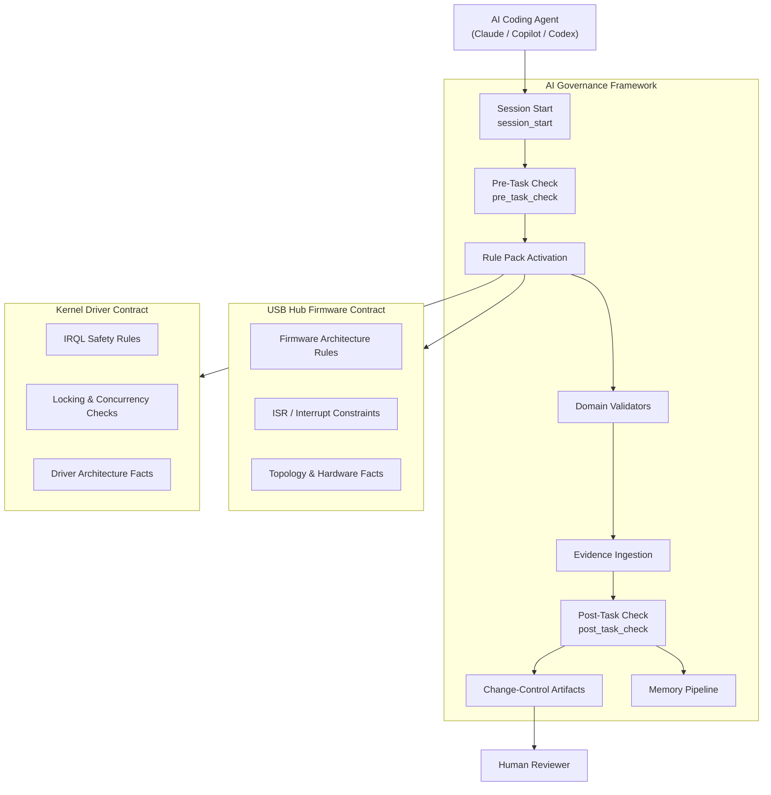
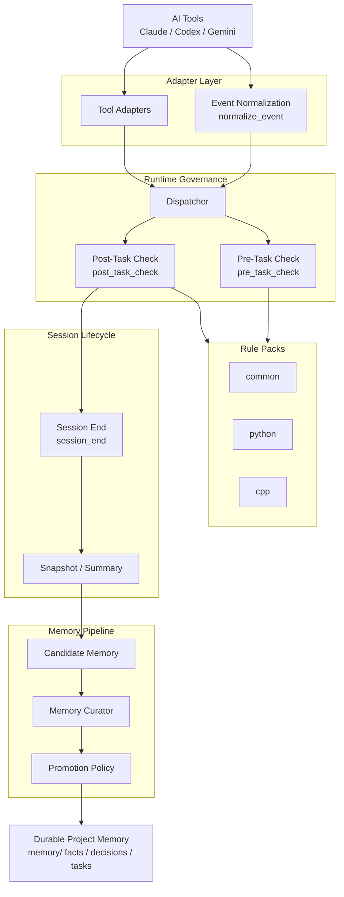
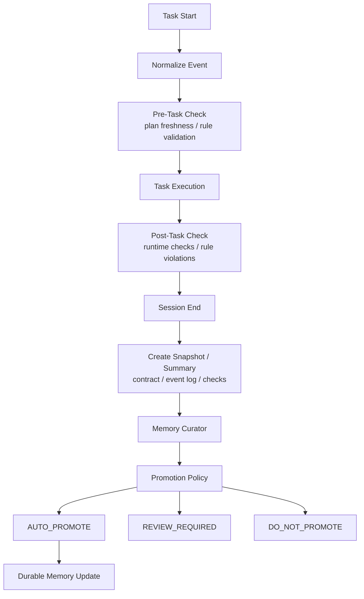

# AI Governance Framework

> Move from "asking AI to help write code" to "making AI work inside a governance framework."

[](https://opensource.org/licenses/MIT)
[](docs/releases/v1.0.0-alpha.md)
[](http://makeapullrequest.com)

## What This Is

In long-lived projects, the most common AI failure modes are not "the answer was not smart enough once," but:

- gradually forgetting context
- drifting away from the current sprint or phase
- breaking architectural boundaries
- finishing tasks without leaving reviewable knowledge behind

This repository provides governance documents, validation tools, and runtime hooks that move an AI coding workflow from:

`AI -> code -> human review`

to:

`AI -> runtime governance -> task execution -> session lifecycle -> memory governance`

The most precise current positioning is:

- a runnable `AI Coding Runtime Governance Framework prototype`
- a framework with a real runtime governance spine, not just static policy documents
- an established external domain validator seam, with the first firmware vertical slice already running
- an explicit v2.6 decision-model draft for moving from mixed enforcement to runtime-centered enforcement
- still actively strengthening:
  - semantic verification depth
  - practical git-hook / CI-gate interception coverage
  - lower-friction workflow embedding around contract discovery, smoke, handoff, and change-control flows

## Alpha Status

Current release-facing status:

- version: `v1.0.0-alpha`
- release notes: [docs/releases/v1.0.0-alpha.md](docs/releases/v1.0.0-alpha.md)
- release index: [docs/releases/README.md](docs/releases/README.md)
- changelog: [CHANGELOG.md](CHANGELOG.md)
- known limits: [docs/LIMITATIONS.md](docs/LIMITATIONS.md)
- status index: [docs/status/README.md](docs/status/README.md)
- trust signal dashboard: [docs/status/trust-signal-dashboard.md](docs/status/trust-signal-dashboard.md)
- domain enforcement matrix: [docs/status/domain-enforcement-matrix.md](docs/status/domain-enforcement-matrix.md)
- current governance-friction notes: [memory/2026-03-20.md](memory/2026-03-20.md)

This alpha is suitable for evaluation, internal adoption trials, and domain-contract experimentation.
It should still be treated as a governance framework prototype rather than a fully closed enforcement platform.

Recent governance simplification direction:

- `L0 fast-track` is being treated as a real lightweight path for bounded
  presentation-only and prototype work
- root `AGENTS.md` and `governance/AGENT.md` are now explicitly split into
  workspace behavior vs repo governance roles to reduce document-conflict load
- failure-mode testing is now being defined as an explicit runtime trust gate,
  not left as an implicit future concern

### Validation Status

| What Has Been Validated | Status |
|-------------------------|--------|
| Core governance tools pass automated test suite (444 tests) | ✅ Done |
| Runtime hooks work across Claude / Codex / Gemini adapters | ✅ Done |
| External domain contract seam (firmware, kernel-driver, IC-verification) | ✅ Done |
| CI pipeline runs governance checks on every push | ✅ Done |
| Quickstart smoke reproducible in < 5 minutes | ✅ Done |
| **External adopter trial: end-to-end session lifecycle in a real project** | **⏳ Next Gate** |
| Independent human reviewer successfully onboards without author guidance | ⏳ Not yet |

The next gate before moving out of alpha is: **at least one external project completes a full session lifecycle (session_start → pre_task → post_task → session_end → memory promotion) using this framework without author intervention.**

## Comparison & Differentiation

The closest open-source comparison set currently includes:

- `AI-Governor-Framework`
- `GAAI-framework`
- `agentic-engineering-framework`
- `TinySDLC`

The simplest way to describe the difference is:

- this repository is designed around a **multi-repo runtime-governance stack** with:
  - external domain contracts
  - a transitional mixed-enforcement seam moving toward runtime-centered enforcement
  - reviewer / trust / release publication surfaces
- and it operates primarily at the **task/session boundary**
  - rather than trying to govern every agent action or every generation token inside the model runtime

See [docs/competitive-landscape.md](docs/competitive-landscape.md) for the fuller comparison memo and the scope note on how those comparisons should be read.

## Cross-Domain Governance Map



## Core Capabilities

### 1. Governance Constitution

The `governance/` directory defines AI roles, boundaries, and stop conditions inside the repository:

- `SYSTEM_PROMPT.md`
- `HUMAN-OVERSIGHT.md`
- `AGENT.md`
- `ARCHITECTURE.md`
- `REVIEW_CRITERIA.md`
- `TESTING.md`
- `NATIVE-INTEROP.md`
- `PLAN.md`

The `.github/` directory also provides a pre-runtime interaction layer:

- `copilot-instructions.md` as a repo-wide baseline
- `.github/agents/*.agent.md` as role definitions
- `.github/skills/*/skill.md` as behavior-level skill policies

The repo now also carries Claude-local workflow skills under [`.claude/skills/`](./.claude/skills/), with a small index at [`.claude/README.md`](./.claude/README.md).

Current local skills:

- `external-onboarding`
- `reviewer-handoff`
- `domain-contract-authoring`
- `runtime-smoke`

These are intentionally narrow workflow skills for common repo-local tasks such as external repo onboarding, reviewer packet generation, domain contract scaffolding, and runtime smoke validation.

### 2. Static Governance Tooling

`governance_tools/` currently includes:

- `contract_validator.py`
- `plan_freshness.py`
- `memory_janitor.py`
- `state_generator.py`
- `rule_pack_loader.py`
- `test_result_ingestor.py`
- `failure_test_validator.py`
- `failure_completeness_validator.py`
- `public_api_diff_checker.py`
- `driver_evidence_validator.py`
- `rule_pack_suggester.py`
- `architecture_drift_checker.py`
- `governance_auditor.py`
- `change_proposal_builder.py`
- `change_control_summary.py`

### 3. Runtime Governance

`runtime_hooks/` currently supports:

- a shared event contract
- a dispatcher
- `session_start`
- `pre_task_check`
- `post_task_check`
- `session_end`
- Claude Code / Codex / Gemini adapters
- `session_start -> pre_task_check -> post_task_check -> session_end -> memory pipeline`

This runtime governance loop is real and operational, but interception coverage is still not fully closed. Some IDE, local-edit, or direct-commit paths can still bypass it.

More precisely, the remaining runtime hardening work is:

- `interception coverage`
  - strengthen practical governance entrypoints such as git hooks, CI gates, and external onboarding flows
  - reduce the chance that direct commit or non-standard workflows bypass the framework
- `workflow embedding`
  - keep lowering day-to-day friction through contract auto-discovery, contract-aware smoke paths, reviewer handoff, and change-control flows

This hardening direction is about **commit/merge-time governance**.
It is **not** a plan to intercept every IDE action or every generation token inside the AI tool itself.

### 4. Memory Pipeline

`memory_pipeline/` currently supports:

- `session_snapshot.py`
- `memory_curator.py`
- `promotion_policy.py`
- `memory_promoter.py`
- `session_end.py` / `memory_curator.py` now also preserve domain contract metadata
  - for example: `contract_source`, `contract_name`, `contract_domain`, `plugin_version`
  - so external domain governance context can survive into summaries and curated artifacts

### 5. Rule Packs

Built-in rule packs currently include:

Scope packs:

- `common`
- `refactor`

Language packs:

- `python`
- `cpp`
- `csharp`
- `swift`

Framework packs:

- `avalonia`

Platform packs:

- `kernel-driver`

Highlights:

- `cpp` includes build-boundary rules such as forbidding cross-project private includes and incorrect `AdditionalIncludeDirectories` usage
- `csharp` focuses on thread and native boundaries
- `avalonia` focuses on UI thread and ViewModel boundaries
- `swift` focuses on concurrency and native interop boundaries
- `kernel-driver` focuses on IRQL, memory boundaries, cleanup, unwind, and other privileged-risk concerns
- `kernel-driver` evidence should come primarily from SDV / SAL / WDK analysis outputs and driver-focused tests, not from a homemade "do everything" parser
- rule packs currently behave more like a policy activation layer than a full policy engine
- the next runtime step is captured in `governance/governance_decision_model.v2.6.json`, which defines ownership, policy precedence, evidence trust, violation handling, and a determinism contract as machine-checkable spec inputs
- `test_result_ingestor.py` now normalizes not only `pytest-text` / `junit-xml`, but also `sdv-text`, `msbuild-warning-text`, `sarif`, and `wdk-analysis-text`
- `architecture_drift_checker.py` now supports before/after dependency edge diffs in addition to high-signal heuristics
- `state_generator.py` now emits advisory `rule_pack_suggestions`, but does not silently rewrite `runtime_contract.rules`
- `pre_task_check.py` now surfaces the same advisory suggestions so runtime entrypoints and state views stay aligned
- when a high-confidence language/framework suggestion is not loaded, `pre_task_check.py` emits an advisory warning instead of auto-rewriting the contract
- `rule_pack_suggester.py`, `state_generator.py`, and `pre_task_check.py` now all expose `suggested_rules_preview` for quick adoption
- those same tools also expose advisory `suggested_skills` and `suggested_agent`
- `pre_task_check --format human` now prints `suggested_rules_preview=...`
  - and also prints `suggested_skills=...` and `suggested_agent=...`
- `pre_task_check.py` / `state_generator.py` can now include `architecture_impact_preview`
  - when proposal risk exceeds the current contract, the result remains advisory and does not auto-rewrite `RULES`, `RISK`, or `OVERSIGHT`
  - both tools now also include proposal guidance such as `expected_validators` and `required_evidence`
- `pre_task_check --format human` now prints `impact_validators=...` and `impact_evidence=...`
- `session_end.py` / `memory_curator.py` now preserve `architecture_impact_preview`
  - proposal-time concerns and expected evidence are carried into summary and curated artifacts as part of the audit trail
- `session_end.py` / `memory_curator.py` now preserve `proposal_summary`
  - proposal-time risk / oversight guidance, concerns, and required evidence are carried into summary and curated artifacts
- `session_end.py` now also emits minimal `verdict` and `trace` artifacts under
  `artifacts/runtime/verdicts/` and `artifacts/runtime/traces/`
- `post_task_check --format human` now prints evidence summaries such as `public_api_ok=...` and `failure_completeness_ok=...`
- `architecture_impact_estimator.py` can now produce a structured `Governance Impact Report` during the proposal phase
  - path-based layer heuristics (`touched_layers`, `boundary_risk`)
  - evidence forecasting (`expected_validators`, `required_evidence`)
  - impact signals (`concerns`, `recommended_risk`, `recommended_oversight`)
  - it remains an advisory estimator, not a replacement for governance judgment

### 6. External Domain Seam

The framework currently supports an external domain extension seam with:

- `contract.yaml` discovery
- external rule roots
- validator preflight
- validator execution
- contract-level policy inputs for selected validator rule IDs via `hard_stop_rules`
- versioned validator payload envelopes with backward-compatible legacy fields

This is the current transitional seam, not the final decision architecture.
v2.6 keeps the domain assets in external repos, but moves final verdict
computation, violation handling, and fallback behavior into the runtime's
explicit decision model:

- design note: `docs/governance-runtime-v2.6.md`
- machine-readable draft: `governance/governance_decision_model.v2.6.json`

The built-in example is `examples/usb-hub-contract/`, which can currently:

- load firmware domain documents and behavior overrides
- activate an external `hub-firmware` rule pack
- run `interrupt_safety_validator.py`
- infer interrupt context from `diff_text`, unified diffs, changed source files, and file-based `checks-file` / `diff_file` evidence

This seam has already been validated with three external contract repos:

- `USB-Hub-Firmware-Architecture-Contract`
  - the first real firmware vertical slice
  - already running through `session_start`, `pre_task_check`, and `post_task_check`
  - now also demonstrates contract-driven runtime policy input for `HUB-004` interrupt-safety violations
- `Kernel-Driver-Contract`
  - the second low-level domain slice
  - already running through contract loading, validator preflight, external rule activation, and a multi-validator post-task loop where contract `hard_stop_rules` are classified by the runtime policy layer
  - current tested coverage includes:
    - synthetic fixture coverage for dispatch registration, IRQL safety, DPC/ISR blocking behavior, pageable-section checks, pool-allocation policy, sync primitives, static-analysis evidence ingestion, and WDF interrupt lifecycle handling
    - ground-truth callback classification against real Windows sample-driver families including KMDF PCI/NDIS-style samples (`pcidrv_*`), KMDF USB FX2 samples (`fx2_*`), a WDM cancel-safe IRP queue sample (`cancel_cancel`), and the `kbfiltr` keyboard-filter sample
  - it has not yet been connected to one real product driver repository as the source of truth; current validation is still based on fixtures plus sample-driver ground truth rather than intake from a live driver codebase
- `IC-Verification-Contract`
  - the third domain slice, focused on Cocotb-style signal-map verification
  - already running through contract loading, validator preflight, external rule activation, and a mixed policy-input/advisory post-task loop driven by machine-readable DUT facts

To reduce adoption friction, runtime hooks now support contract auto-discovery:

- use explicit `--contract` first
- otherwise read `AI_GOVERNANCE_CONTRACT`
- otherwise search upward from `project_root` or evidence file paths for `contract.yaml`
- discovery ascends at most 3 levels and stops at a `.git` boundary
- when multiple candidates are found, it does not silently pick one; it returns a warning and asks for an explicit path

For multi-domain reviewer flows, the framework also preserves minimal contract governance metadata:

- `contract_source`
- `contract_name`
- `contract_domain`
- `plugin_version`
- `contract_risk_tier`

Current built-in risk-tier defaults:

- `kernel-driver` -> `high`
- `firmware` -> `medium`

## Local Execution Requirements

The governance tools and runtime hooks in this repo require Python 3.9+.

If `python`, `python3`, or `py -3` is not on `PATH`, set:

```bash
export AI_GOVERNANCE_PYTHON=/path/to/python
```

Windows PowerShell:

```powershell
$env:AI_GOVERNANCE_PYTHON='C:\Path\To\python.exe'
```

`scripts/run-runtime-governance.sh`, `scripts/verify_phase_gates.sh`, and installed git hooks all prefer this variable.

When hooks are installed into another repo, the install script now writes a framework-root pointer under the target repo's `.git/hooks/` directory so the copied hooks can call back into `ai-governance-framework` instead of assuming all governance scripts live inside the target repo.
After installation, you can also run `governance_tools/hook_install_validator.py --repo /path/to/repo` to verify copied hooks and framework-root wiring.
By default, `scripts/install-hooks.sh` now runs this validator automatically after installation; if you only want installation without verification, use `--no-verify`.
If you want a single readiness check for an external repo's hook / PLAN / contract state, run `governance_tools/external_repo_readiness.py --repo /path/to/repo`.
If you want a single onboarding entrypoint, run `scripts/onboard-external-repo.sh --target /path/to/repo`, which combines hook installation, readiness checks, governance smoke, and onboarding report emission.
That onboarding flow now includes a minimal governance smoke test by default, so onboarding checks that `session_start` and `pre_task_check` can actually run against the external contract instead of only verifying static setup.
By default it writes onboarding artifacts under `memory/governance_onboarding/` inside the target repo, including `latest.json`, `latest.txt`, `history/*.json`, `history/*.txt`, and `INDEX.txt`, so external repo setup state remains reviewable after the terminal session ends.
If you are tracking multiple external repos, you can aggregate their latest onboarding states with `governance_tools/external_repo_onboarding_index.py --repo /path/to/repo1 --repo /path/to/repo2`.
If you want to intake an external repo's `memory/02_project_facts.md` or `memory/02_tech_stack.md` into a provenance-rich framework artifact, run `governance_tools/external_project_facts_intake.py --repo /path/to/repo`.
That tool writes a framework-side JSON artifact under `artifacts/external-project-facts/<repo>.json` and records source file provenance, sync direction, and content hash so external facts become reviewable input instead of only an accepted alias.
`external_repo_readiness.py` and the onboarding report now also surface this external fact-source metadata, so external `project_facts` become visible in readiness/onboarding output even when they are not yet a hard gate.
Those surfaces now also expose the canonical framework-side `artifact_path` and `artifact_exists` state, so reviewers can tell where the intake artifact should live before treating external facts as reusable framework input.
They also surface a minimal drift signal: when an existing framework-side intake artifact has a different `content_sha256` than the current external `project_facts`, readiness/onboarding now mark that as `artifact_drift` without turning it into a hard readiness failure yet.
The `project_facts` surface now also carries a small status model: `available`, `missing`, `drifted`, or `intake-error`, so external fact gaps are machine-readable instead of being implied only by warning strings.
For non-healthy states (`missing`, `drifted`, `intake-error`), readiness/onboarding now also emit a `remediation_hint` that points back to `external_project_facts_intake.py`.
Human-readable readiness/onboarding output now also surfaces a one-line `project_facts` summary near the top, so reviewers do not need to scroll into the detailed section just to see whether facts are `available`, `missing`, or `drifted`.
Example:

```bash
bash scripts/onboard-external-repo.sh --target /path/to/Kernel-Driver-Contract --format human
```
If you also want to know whether an adopter repo is still on the latest framework release, record its adoption state in `governance/framework.lock.json` inside the target repo.
The lock file should include at least `adopted_release`, `adopted_commit`, `framework_interface_version`, and `framework_compatible`.
`external_repo_readiness.py` now surfaces that version state as `current`, `outdated`, `incompatible`, or `unknown`.
If you want a fleet-level version drift view, run `governance_tools/external_repo_version_audit.py --repo /path/to/repo1 --repo /path/to/repo2`.
If you want to catch "feature surface moved ahead but docs did not" drift, run `governance_tools/doc_drift_checker.py --project-root /path/to/repo`.
That checker uses `governance_tools/feature_surface_snapshot.py` to scan app routes, API routes, and migrations, then compares them against `PLAN.md` and README coverage.

Example:

```text
RULES = common,csharp,avalonia,refactor
```

- `common`: global governance baseline
- `csharp`: language-level boundary, threading, and native contract rules
- `avalonia`: UI / Dispatcher / ViewModel boundaries
- `refactor`: change-type governance requiring behavior lock and boundary safety, then gradually asking for interface stability, regression evidence, and cleanup / rollback evidence

A high-risk platform example:

```text
RULES = common,cpp,kernel-driver,refactor
RISK = high
OVERSIGHT = human-approval
MEMORY_MODE = candidate
```

## Runtime Governance Overview

Core Governance Contract fields:

```text
RULES       = <comma-separated rule packs>
RISK        = <low|medium|high>
OVERSIGHT   = <auto|review-required|human-approval>
MEMORY_MODE = <stateless|candidate|durable>
```

### Architecture Overview



### Runtime Flow



## Quick Start

For a five-minute guided run, start with [start_session.md](start_session.md).

Verify installation with one command:

```bash
python governance_tools/quickstart_smoke.py --project-root . --plan PLAN.md --contract examples/usb-hub-contract/contract.yaml --format human
```

Expected output:

```
[quickstart_smoke]
ok=True
summary=ok=True | pre_task_ok=True | session_start_ok=True | contract=firmware/medium
```

### Core Workflow

The highest-level reviewer view — combines trust signals, release state, and governance posture:

```bash
python governance_tools/reviewer_handoff_summary.py --project-root . --plan PLAN.md --release-version v1.0.0-alpha --contract examples/usb-hub-contract/contract.yaml --format human
```

For a release/adoption overview across external contract repos:

```bash
python governance_tools/trust_signal_overview.py --project-root . --plan PLAN.md --release-version v1.0.0-alpha --contract examples/usb-hub-contract/contract.yaml --format human
```

### Tool Reference

#### Trust Signals

| Tool | Purpose |
|------|---------|
| `trust_signal_overview.py` | Single-command release/adoption overview |
| `trust_signal_snapshot.py` | Persist as latest/history/index bundle |
| `trust_signal_publication_reader.py` | Read stable publication metadata |

#### Release Package

| Tool | Purpose |
|------|---------|
| `release_surface_overview.py` | Roll readiness + package + publication into one view |
| `release_package_summary.py` | Alpha docs + status surfaces + verification commands |
| `release_package_snapshot.py` | Persist as a versioned bundle |
| `release_package_reader.py` | Read a versioned bundle |
| `release_package_publication_reader.py` | Read stable repo-local release root |

#### Reviewer Handoff

| Tool | Purpose |
|------|---------|
| `reviewer_handoff_summary.py` | Trust + release summary in one reviewer handoff |
| `reviewer_handoff_snapshot.py` | Persist as a versioned bundle |
| `reviewer_handoff_reader.py` | Read a versioned bundle |
| `reviewer_handoff_publication_reader.py` | Read publication-layer summary |

### CI Artifacts

CI generates the following on every push:

| Path | Contents |
|------|----------|
| `artifacts/trust-signals/` | Trust-signal snapshot with history/index and publication manifest |
| `artifacts/release-package/` | Release-package bundle (docs, status surfaces, verification commands) |
| `artifacts/release-surface/` | Release-surface overview (readiness + package + publication posture) |
| `artifacts/reviewer-handoff/` | Highest-level reviewer handoff bundle |
| `docs/releases/generated/README.md` | Stable in-repo landing page for generated release packages |
| `docs/status/reviewer-handoff.md` | Stable in-repo landing page for the reviewer handoff packet |

### Minimum Viable Setup

Install the documented local dependencies first:

```bash
pip install -r requirements.txt
```

The core framework stays largely stdlib-first, but `requirements.txt` covers:

- local validation via `pytest`
- the runnable FastAPI demo under `examples/todo-app-demo`

If you want to bring this governance framework into an existing project, the simplest path is:

```bash
git clone https://github.com/GavinWu672/ai-governance-framework.git
cd ai-governance-framework

./deploy_to_memory.sh /path/to/your/project
```

Or copy the essentials manually:

```bash
cp -r governance /path/to/your/project/
cp -r governance_tools /path/to/your/project/
```

At minimum, prepare:

- `governance/`
- `PLAN.md`
- `memory/`

Then, when starting a new conversation or a new agent session, ask the agent to do this first:

```text
Please read governance/SYSTEM_PROMPT.md in full,
follow the initialization process in section 2,
and report back with a [Governance Contract] block.
```

### Example Projects

See:

- `examples/README.md`
- `examples/starter-pack/`
- `examples/todo-app-demo/`
- `examples/chaos-demo/`

## Common Entry Points

### Static Governance Tools

```bash
python governance_tools/contract_validator.py --file ai_response.txt
python governance_tools/plan_freshness.py --plan PLAN.md
python governance_tools/state_generator.py --rules common,python,cpp --risk medium --oversight review-required --memory-mode candidate
python governance_tools/state_generator.py --rules common,refactor --impact-before before.cs --impact-after after.cs --format json
python governance_tools/memory_janitor.py --memory-root ./memory --check
python governance_tools/failure_test_validator.py --file test_names.json --format json
python governance_tools/failure_completeness_validator.py --file checks.json --format json
python governance_tools/public_api_diff_checker.py --before before.cs --after after.cs --format json
python governance_tools/architecture_impact_estimator.py --before before.cs --after after.cs --rules common,refactor --scope refactor --format human
python governance_tools/change_proposal_builder.py --project-root . --task-text "Refactor Avalonia boundary" --rules common,refactor --impact-before before.cs --impact-after after.cs --format human
python governance_tools/change_control_summary.py --session-start-file session_start.json --session-end-file session_end_summary.json --format human
python governance_tools/driver_evidence_validator.py --file checks.json --format json
python governance_tools/refactor_evidence_validator.py --file checks.json --format json
python governance_tools/rule_pack_suggester.py --project-root . --task "Refactor Avalonia view model boundary"
python governance_tools/governance_auditor.py --format json
python governance_tools/trust_signal_snapshot.py --project-root . --plan PLAN.md --release-version v1.0.0-alpha --contract examples/usb-hub-contract/contract.yaml --write-bundle artifacts/trust-signals --format human
python governance_tools/trust_signal_publication_reader.py --file artifacts/trust-signals/PUBLICATION_MANIFEST.json --format human
python governance_tools/trust_signal_overview.py --project-root . --plan PLAN.md --release-version v1.0.0-alpha --contract examples/usb-hub-contract/contract.yaml --format human
```

### Runtime Hooks

```bash
python runtime_hooks/core/pre_task_check.py --rules common,python,cpp --risk high --oversight review-required
python runtime_hooks/core/session_start.py --project-root . --plan PLAN.md --rules common,refactor --task-text "Refactor Avalonia boundary" --impact-before before.cs --impact-after after.cs
python runtime_hooks/smoke_test.py --event-type session_start
python runtime_hooks/smoke_test.py --event-type session_start --contract examples/usb-hub-contract/contract.yaml
python runtime_hooks/dispatcher.py --file runtime_hooks/examples/shared/session_start.shared.json --contract examples/usb-hub-contract/contract.yaml
python runtime_hooks/core/pre_task_check.py --rules common,refactor --risk medium --oversight review-required --impact-before before.cs --impact-after after.cs
python runtime_hooks/core/post_task_check.py --file ai_response.txt --risk medium --oversight review-required --checks-file checks.json --api-before before.cs --api-after after.cs
python runtime_hooks/core/session_end.py --project-root . --session-id 2026-03-12-01 --runtime-contract-file contract.json --checks-file checks.json --impact-preview-file impact.json --proposal-summary-file proposal_summary.json --event-log-file event_log.json --response-file ai_response.txt
```

For refactor tasks, `checks.json` can now also include:

- `error_path_inventory`
- `error_behavior_diff`

This makes error-path behavior explicit before and after a refactor. The framework validates structure and reviewer-facing traceability, but it does not prove that the inventory is exhaustive or semantically correct.

Kernel-driver evidence flow:

```text
SDV / SAL / WDK diagnostics
        ↓
normalized checks payload
        ↓
driver_evidence_validator.py
        ↓
post_task_check.py
```

Public API diff audit flow:

```text
public_api_diff_checker.py
        ↓
post_task_check.py
        ↓
session_end summary / curated artifact
```

Architecture impact audit flow:

```text
architecture_impact_estimator.py
        ↓
pre_task_check.py / state_generator.py
        ↓
session_end summary / curated artifact
```

Change proposal flow:

```text
task text + project signals + impact files
        ↓
change_proposal_builder.py
        ↓
suggested rules + proposal guidance + impact preview + proposal_summary
```

Session-start handoff flow:

```text
state_generator.py + pre_task_check.py + change_proposal_builder.py
        ↓
session_start.py
        ↓
agent start context + proposal_summary
```

Session-end audit flow:

```text
proposal_summary + runtime checks + impact preview
        ↓
session_end.py
        ↓
summary artifact + curated artifact
```

Change-control summary flow:

```text
session_start context + session_end summary
        ↓
change_control_summary.py
        ↓
reviewable change-control summary
```

`change_control_summary.py --format human` now starts with a reviewer-first summary line, then drills into proposal and runtime sections.
`change_control_index.py` also enriches artifacts with contract context from the corresponding `*_session_start.json`, so reviewers can see which domain contract drove each session when scanning across sessions.
`session_end.py` human output, summary artifacts, and curated artifacts preserve the same contract metadata, so the reviewer chain stays consistent in multi-domain environments.

### Adapters

```bash
python runtime_hooks/adapters/claude_code/normalize_event.py --event-type pre_task --file claude_event.json
python runtime_hooks/adapters/codex/normalize_event.py --event-type post_task --file codex_event.json
python runtime_hooks/adapters/gemini/normalize_event.py --event-type pre_task --file gemini_event.json
```

### Memory Pipeline

```bash
python memory_pipeline/session_snapshot.py --memory-root memory --task "Runtime governance" --summary "Captured a candidate snapshot"
python memory_pipeline/memory_curator.py --candidate-file artifacts/runtime/candidates/<session_id>.json --output artifacts/runtime/curated/<session_id>.json
python memory_pipeline/memory_promoter.py --memory-root memory --candidate-file memory/candidates/session_*.json --approved-by reviewer-01
```

### Smoke Test

```bash
python runtime_hooks/smoke_test.py --harness claude_code --event-type pre_task
python runtime_hooks/smoke_test.py --harness claude_code --event-type session_start
python runtime_hooks/smoke_test.py --harness codex --event-type post_task
python runtime_hooks/smoke_test.py --harness codex --event-type session_start
python runtime_hooks/smoke_test.py --harness gemini --event-type post_task
python runtime_hooks/smoke_test.py --harness gemini --event-type session_start
python runtime_hooks/smoke_test.py --event-type session_start
```

`runtime_hooks/smoke_test.py` now also accepts `--contract`, `--project-root`, and `--plan-path`, so the built-in example payloads can be replayed against an external contract repo without editing the example JSON files first.
If only `--contract` is supplied, it now defaults `project_root` and `plan_path` from the contract repo only when that contract root also contains `PLAN.md`; otherwise it preserves the example payload's original root/plan.
The shared shell wrapper `scripts/run-runtime-governance.sh` now forwards the same overrides into its smoke flows, so the common hook/CI entrypoint can replay those examples against an external contract repo too.
`runtime_hooks/dispatcher.py` now mirrors the same override pattern for shared event JSON, so the lowest-level shared-event path no longer requires hand-editing the payload just to point at a different contract or repo root.
Both runtime entrypoints now also accept `--response-file` and `--checks-file`, making it easier to replay file-based post-task evidence against a real domain contract instead of only the bundled response fixture.

`session_start` smoke output now shows startup handoff summaries directly, including the active contract, expected validators, and required evidence.
Shared enforcement now also preserves:

- `*_session_start.txt` handoff notes
- `*_session_start.json` machine-readable startup envelopes
- `*_change_control_summary.txt` proposal-to-startup review summaries
- `INDEX.txt` change-control artifact index

Among these, `*_session_start.json` can be used directly as input to `change_control_summary.py --session-start-file ...`.

### Shared Enforcement

```bash
bash scripts/run-runtime-governance.sh --mode enforce
```

## Multi-Tool Support

The runtime layer currently supports multiple AI tools:

- Claude Code
- Codex
- Gemini

These tools all normalize native payloads into the same shared event contract before entering governance checks.

`session_start` currently exists first as a shared governance event for agent startup and handoff context; native harness adapters can be added on top later.
The shared adapter runner can now already process `session_start`, so startup chains can be exercised through shared/native examples today.

Related files:

- `runtime_hooks/event_contract.md`
- `runtime_hooks/event_schema.json`
- `runtime_hooks/examples/shared/`
- `runtime_hooks/examples/claude_code/`
- `runtime_hooks/examples/codex/`
- `runtime_hooks/examples/gemini/`

## CI and Validation

The GitHub Actions workflow lives at:

- `.github/workflows/governance.yml`

It now includes the shared runtime enforcement path and verifies:

- native payload normalization
- shared event dispatch
- pre/post-task checks
- session close and curated memory flow
- the focused runtime governance test suite
- uploaded `artifacts/runtime/smoke/` handoff summaries from `session_start` smoke flows
- uploaded JSON startup envelopes and derived change-control summaries from `session_start` smoke flows

## Current Boundary

This repo is positioned as a **runtime governance framework prototype**, not a general-purpose agent platform.

It is focused on:

- governance constitution
- runtime governance lifecycle
- session lifecycle closeout
- memory governance
- reviewable project truth

It is not currently trying to become:

- a plugin marketplace
- a large command registry
- a general-purpose subagent orchestration platform
- an IDE-native or token-level AI generation interception system

## Further Reading

- `docs/competitive-landscape.md`
- `docs/runtime-governance-update.md`
- `runtime_hooks/README.md`
- `memory_pipeline/README.md`
- `governance_tools/README.md`
- `CONTRIBUTING.md`

## License

This project is licensed under the MIT License. See `LICENSE`.
