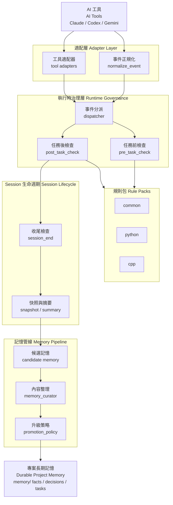
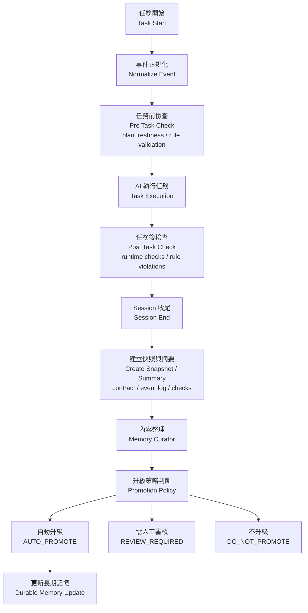

# AI Governance Framework

> 從「叫 AI 幫忙寫程式」進化到「讓 AI 在治理框架內工作」。

[](https://opensource.org/licenses/MIT)
[](https://github.com/GavinWu672/ai-governance-framework)
[](http://makeapullrequest.com)

## 這是什麼

AI 在長期專案裡常見的問題不是單次回答不夠聰明，而是：

- 逐漸忘記上下文
- 偏離目前 sprint 或 phase
- 破壞架構邊界
- 任務做完後沒有留下可審核的知識

這個 repo 提供一套治理文件、驗證工具與 runtime hooks，讓 AI coding workflow 從：

`AI -> code -> human review`

變成：

`AI -> runtime governance -> task execution -> session lifecycle -> memory governance`

## 核心能力

### 1. 治理憲法

`governance/` 目錄定義了 AI 在專案中的角色、邊界與停止條件：

- `SYSTEM_PROMPT.md`
- `HUMAN-OVERSIGHT.md`
- `AGENT.md`
- `ARCHITECTURE.md`
- `REVIEW_CRITERIA.md`
- `TESTING.md`
- `NATIVE-INTEROP.md`
- `PLAN.md`

### 2. 靜態治理工具

`governance_tools/` 目前包含：

- `contract_validator.py`
- `plan_freshness.py`
- `memory_janitor.py`
- `state_generator.py`
- `rule_pack_loader.py`
- `test_result_ingestor.py`
- `architecture_drift_checker.py`
- `governance_auditor.py`

### 3. Runtime Governance

`runtime_hooks/` 目前已支援：

- shared event contract
- dispatcher
- `pre_task_check`
- `post_task_check`
- `session_end`
- Claude Code / Codex / Gemini adapters

### 4. Memory Pipeline

`memory_pipeline/` 目前已支援：

- `session_snapshot.py`
- `memory_curator.py`
- `promotion_policy.py`
- `memory_promoter.py`

### 5. Rule Packs

目前已內建的 rule packs：

- `common`
- `python`
- `cpp`

其中 `cpp` 已包含 build-boundary 規則，例如禁止跨專案 private include 與錯誤使用 `AdditionalIncludeDirectories`。

## 執行時治理總覽

核心 Governance Contract 欄位：

```text
RULES       = <comma-separated rule packs>
RISK        = <low|medium|high>
OVERSIGHT   = <auto|review-required|human-approval>
MEMORY_MODE = <stateless|candidate|durable>
```

### 架構總覽 (Runtime Architecture)



### 任務治理流程 (Runtime Flow)



## 快速開始

### 最小可用版

如果你要先把治理框架帶進現有專案，最簡單的路徑是：

```bash
git clone https://github.com/GavinWu672/ai-governance-framework.git
cd ai-governance-framework

./deploy_to_memory.sh /path/to/your/project
```

或手動複製：

```bash
cp -r governance /path/to/your/project/
cp -r governance_tools /path/to/your/project/
```

建議至少準備：

- `governance/`
- `PLAN.md`
- `memory/`

之後在新對話或新 agent 啟動時，先要求它：

```text
請先完整閱讀 governance/SYSTEM_PROMPT.md，
並依照 §2 初始化流程執行，完成後回報 [Governance Contract]。
```

### 範例專案

可參考：

- `examples/starter-pack/`
- `examples/todo-app-demo/`
- `examples/chaos-demo/`

## 常用入口

### 靜態治理工具

```bash
python governance_tools/contract_validator.py --file ai_response.txt
python governance_tools/plan_freshness.py --plan PLAN.md
python governance_tools/state_generator.py --rules common,python,cpp --risk medium --oversight review-required --memory-mode candidate
python governance_tools/memory_janitor.py --memory-root ./memory --check
python governance_tools/governance_auditor.py --format json
```

### Runtime Hooks

```bash
python runtime_hooks/core/pre_task_check.py --rules common,python,cpp --risk high --oversight review-required
python runtime_hooks/core/post_task_check.py --file ai_response.txt --risk medium --oversight review-required
python runtime_hooks/dispatcher.py --file shared_event.json
python runtime_hooks/core/session_end.py --project-root . --session-id 2026-03-12-01 --runtime-contract-file contract.json --checks-file checks.json --event-log-file event_log.json --response-file ai_response.txt
```

### Adapters

```bash
python runtime_hooks/adapters/claude_code/normalize_event.py --event-type pre_task --file claude_event.json
python runtime_hooks/adapters/codex/normalize_event.py --event-type post_task --file codex_event.json
python runtime_hooks/adapters/gemini/normalize_event.py --event-type pre_task --file gemini_event.json
```

### Memory Pipeline

```bash
python memory_pipeline/session_snapshot.py --memory-root memory --task "Runtime governance" --summary "Captured a candidate snapshot"
python memory_pipeline/memory_curator.py --candidate-file artifacts/runtime/candidates/<session_id>.json --output artifacts/runtime/curated/<session_id>.json
python memory_pipeline/memory_promoter.py --memory-root memory --candidate-file memory/candidates/session_*.json --approved-by reviewer-01
```

### Smoke Test

```bash
python runtime_hooks/smoke_test.py --harness claude_code --event-type pre_task
python runtime_hooks/smoke_test.py --harness codex --event-type post_task
python runtime_hooks/smoke_test.py --harness gemini --event-type post_task
```

### Shared Enforcement

```bash
bash scripts/run-runtime-governance.sh --mode enforce
```

## 多工具支援

目前 runtime layer 已支援多種 AI 工具：

- Claude Code
- Codex
- Gemini

這些工具都會先把 native payload 正規化成同一個 shared event contract，再進入 governance checks。

相關檔案：

- `runtime_hooks/event_contract.md`
- `runtime_hooks/event_schema.json`
- `runtime_hooks/examples/shared/`
- `runtime_hooks/examples/claude_code/`
- `runtime_hooks/examples/codex/`
- `runtime_hooks/examples/gemini/`

## CI 與驗證

GitHub Actions workflow 在：

- `.github/workflows/governance.yml`

目前已包含 shared runtime enforcement path，可驗證：

- native payload normalization
- shared event dispatch
- pre/post task checks
- session close and curated memory flow
- focused runtime governance test suite

## 目前邊界

這個 repo 的定位是 **governance framework**，不是通用 agent platform。

它專注處理：

- governance constitution
- runtime interception
- session lifecycle close
- memory governance
- reviewable project truth

它目前不打算擴成：

- plugin marketplace
- 大型 command registry
- 通用 subagent orchestration platform

## 延伸閱讀

- `docs/runtime-governance-update.md`
- `runtime_hooks/README.md`
- `memory_pipeline/README.md`
- `governance_tools/README.md`
- `CONTRIBUTING.md`

## 授權

本專案採用 MIT License。詳見 `LICENSE`。
