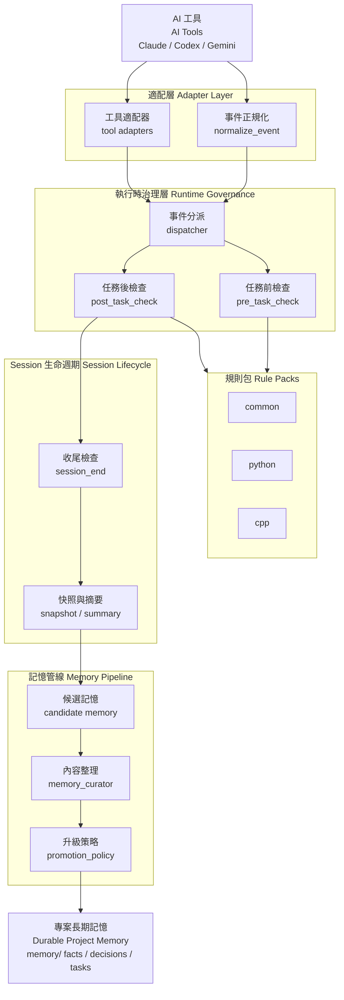
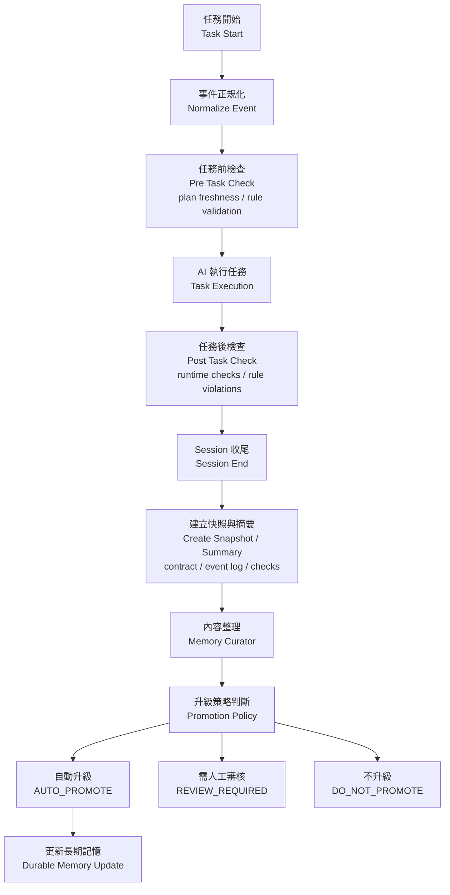

# AI Governance Framework

> 敺€今?誘???閬??€?霈?AI 銝?瘥活?賡??剔?閫????獢?
[](https://opensource.org/licenses/MIT)
[](https://github.com/GavinWu672/ai-governance-framework)
[](http://makeapullrequest.com)

---

## ? ?隞€暻?

**AI ?券??獢葉?敹€?蝘颯€憯瑽€??臬????*
?€??嗆?靘?憟?瑽???隞嗉?蝭?+ ?芸??極?瘀?霈?AI ?冽??獢€望?靽?**銝??€????*??
> 閰唾? [?€?AI 蝯??批?憿(#-?€?ai-蝯??批?憿? ??瘥€?憿????圾瘜?撌亙??
### ?瘝餌??榆??
```diff
- ??瘝?瘝餌?:
-    雿? 撟急??€???-    AI: 憟賜? (蝡???航??閮)
-    ??AI 銝???
-    ??AI ???拙??-    ??撠店頞頞仃??
+ ???祥??
+    雿? 撟急??€???+    AI: ????PLAN.md ?祇€梁璅 A??
+        ?€??賭??冽??桐葉??隤踵閮??
+    ??AI 銝餃?蝣箄??芸?蝝?+    ??AI ?曉??萄?閮??嚗?撘瑕?瑁?嚗?+    ??AI 撱箄降銝?甇?```

> ?? **瘜冽?**: 隞乩?銵靘陷 AI 霈€?蒂?萄?瘝餌??辣嚗惇?潦€?撠€扳祥??guidance-based嚗€€?> ?仿??€銵撥?嗅銵?commit ??I gate嚗?隢??Git hook + contract_validator嚗? [Plan Freshness ?游?](#-plan-freshness--planmd-?圈悅摨行炎?亙極??嚗€?
---

## ??儭?撱箇?撣怨???隢?
**?詨?憿?**:

| 頠?? | 撱箇?撌亙 | 瘝餌??辣 |
|---------|---------|---------|
| 隞?Ⅳ (Code) | 蝤??偌瘜?| ??|
| ?嗆? (Architecture) | 璅???| ARCHITECTURE.md |
| AI Agent | ?訾?撌仿 | ??|
| 瘝餌??辣 | ?賢極閬???| 8 憭扳???|

> **?孵€潔蜓撘?*:  
> AI ??橘?銝?箔??誨撌亦?撣恬?  
> ??箔?霈極蝔葦撠釣?潦€瑽身閮€?  
> ??踹?撅祆撱箇?撣怎?撠??
---

## ? 8 憭扳???(摰瘝餌??嗆?)

```
?? ??撅?  ?? SYSTEM_PROMPT.md     ??AI ?澈隞質?蝳?

?? 閬?撅?  ?? PLAN.md              ??撠??賢極閮 (隞予?撅斗?) 潃??詨?

?? ?瑁?撅?  ?? AGENT.md             ??隞餃??瑁?瘚?
  ?? ARCHITECTURE.md      ???嗆?蝝? (?輸???
  ?? NATIVE-INTEROP.md    ??頝典像?啗?蝭?
???釭撅?  ?? REVIEW_CRITERIA.md   ??隞?Ⅳ撖拇璅?
  ?? TESTING.md           ??皜祈岫蝑

?? 摰??  ?? HUMAN-OVERSIGHT.md   ??撘瑕??璈
```

### 撱箇?憿?撠銵?
| 瘝餌??辣 | 撱箇?撌亙 | 雿 |
|---------|---------|------|
| SYSTEM_PROMPT.md | 撱箇?撣怨??潸? | 隤唳?鞈?撌仿? |
| **PLAN.md** | **?賢極閮銵?* | **隞予?撅斗??** 潃?|
| ARCHITECTURE.md | 撱箇?閮剛???| ?輸???? 銝?? |
| AGENT.md | ?賢極閬???| ?獐??? 瘚??臭?暻? |
| REVIEW_CRITERIA.md | ?釭撽璅? | 蝤?敺??游?? |
| HUMAN-OVERSIGHT.md | 蝺€亙?撌乩誘 | ?潛??蝡?? |
| TESTING.md | 撌亙摰瑼Ｘ | ?獐撽? |
| NATIVE-INTEROP.md | ??閬 | 瘞湔野??憛?璅? |

---

## ?妝 ?€?AI 蝯??批?憿?
AI coding 撌亙?敹??嗡??舀???**銝??€???改?context continuity嚗?*??瘝?蝛拙???獢?銝?嚗I ???釭?撠店??蝺€找??€?
| ?? | ?? | 獢閫?? | 撌亙 |
|------|------|---------|------|
| **閮瘨仃** | 瘥活 session ??圾撠?嚗?甈⊥捱蝑?憭?| Memory System | `memory_janitor.py` |
| **?€??蝘?* | AI 銝??典?芸€?Phase嚗?鈭??怠??? | State Engine | `PLAN.md` + `plan_freshness.py` |
| **?嗆?憭梁?** | 撅€?其耨?寥€撓蝝舐?嚗憯擃瑽身閮?| Architecture Guardrails | `ARCHITECTURE.md` + `contract_validator.py` |
| **隞餃??臭?** | AI 銝??銝€甇伐??函銝?瘙?蝘?| Alignment Engine | `PLAN.md ?祇€梯??圳 + Linear/Notion ?郊 |

> ?祆??嗥??詨?雿嚗?*restore project context continuity for AI**

---

## ?儭?蝟餌絞?嗆?

```
????????????????????????????????????????????????????            Human Architect                  ????       摰儔閬? 繚 ?? 繚 ?嗆?瘙箇?              ???????????????????????????手?????????????????????????                        ???????????????????????????潑???????????????????????????       Governance Layer (8 憭扳???            ???? SYSTEM_PROMPT 繚 AGENT 繚 ARCHITECTURE         ???? OVERSIGHT 繚 REVIEW 繚 TESTING 繚 PLAN          ???????????????????????????手?????????????????????????                        ??guidance-based
?????????????????????????潑???????????????????????????              AI Agent                       ????        (Claude Code 繚 Cursor 繚 etc.)         ?????手???????????????????手????????????手???????????????  ??           ??     ??          ??  ??           ??     ??          ??Memory       State  Guard-     Alignment
System       Engine rails      Engine
?€?€?€?€?€?€?€?€?€?€   ?€?€?€?€?€  ?€?€?€?€?€?€?€?€?€  ?€?€?€?€?€?€?€?€?€?€
閮瘨仃      ?€??蝘??嗆?憭梁?   隞餃??臭?
memory_      PLAN.md ARCH.md   PLAN ?祇€?janitor      fresh-  contract_ ? 繚
hot/cold     ness    validator Linear/Notion
  ??           ??     ??          ??  ???€?€?€?€?€?€?€?€?€?€?€?氯??€?€?€?€?€?氯??€?€?€?€?€?€?€?€?€?€??                        ???????????????????????????潑???????????????????????????          Automation Layer                   ????  CI 繚 Git Hooks 繚 verify_phase_gates.sh     ????????????????????????????????????????????????????```

> ?? **瘜冽?**: AI ?萄?瘝餌??辣撅研€?撠€折??€???銵撥?嗅銵€?> 閰唾? [LIMITATIONS.md](docs/LIMITATIONS.md)??
---

## ?? 敹恍€?憪?
### ? ?€撠?函?嚗????5 ??嚗?
憒?雿?喳翰?岫閰行???銝銝€甈⊿蝵?8 憭扳??賂?

```bash
git clone https://github.com/GavinWu672/ai-governance-framework.git
cp ai-governance-framework/examples/starter-pack/SYSTEM_PROMPT.md  /your/project/
cp ai-governance-framework/examples/starter-pack/PLAN.md           /your/project/
cp ai-governance-framework/governance_tools/memory_janitor.py      /your/project/
```

憛怠神 `PLAN.md` ???迄 AI 霈€ `SYSTEM_PROMPT.md` ??5 ??頝絲靘€?
閰唾? **[examples/starter-pack/README.md](examples/starter-pack/README.md)** 潃?
---

### 1. ??撠?

```bash
git clone https://github.com/GavinWu672/ai-governance-framework.git
cd ai-governance-framework
```

### 2. ?函蔡?唬???獢?
```bash
# 雿輻?函蔡?單 (?刻)
# ?芸?銴ˊ瘝餌??辣 + ?? PLAN.md 璅⊥ + 撱箇? memory/ ?桅?蝯?
./deploy_to_memory.sh /path/to/your/project

# ????鋆?cp -r governance /path/to/your/project/
cp -r governance_tools /path/to/your/project/
```

?函蔡敺璅?獢?瑽?

```
your-project/
???€ PLAN.md              ???芸????芋?選?憛怠神敺?臭蝙??潃????€ .governance-state.yaml  ????state_generator.py ??嚗?賂?
???€ governance/          ??8 憭扳??????€ governance_tools/    ???芸??極?????€ memory/              ??撱箄降??撱箇?嚗? AI 閮雿輻
    ???€ 00_master_plan.md
    ???€ 01_active_task.md
    ???€ 02_tech_stack.md
    ???€ 03_knowledge_base.md
    ???€ 04_review_log.md  ??AI reviewer ???游祟?亦???    ???€ archive/          ??memory_janitor 甇豢??桅?
        ???€ manifest.json         ???€?飛瑼?雿? audit trail
        ???€ active_task_*.md      ??甇豢????渲??嗅翰??```

### 3. ?迄 AI 霈€?祥??隞?
**蝚砌?甈∪?閰?*:
```
隢霈€ governance/ ?桅?銝??€?祥??隞塚?
銝虫???SYSTEM_PROMPT.md 禮2 ??憪?瘚??瑁?嚗?
??Header Verification: 蝣箄? LANG / LEVEL / SCOPE
??Memory Sync: 霈€??PLAN.md ??memory/ ?桅?
??Bounded Context: 摰???祆活隞餃??痊隞餌?????Dynamic Loading Declaration: 摰???祆活?€頛?芯?瘝餌??辣
```

> **瘜冽?**: SYSTEM_PROMPT.md 禮2 ???瘙?AI 霈€??PLAN.md??> ??PLAN.md 銝??剁?AI ?郎?蒂閬??遣蝡€?
### 4. 憛怠神雿? PLAN.md

?函蔡?單撌脰????`PLAN.md` 璅⊥嚗?€憛怠神撠?鞈?嚗?
```bash
# ??銝衣楊頛舀芋??# 敹‵甈?: 撠??格????Phase??梯??艾€I ??閬?
code PLAN.md   # ?蝙?其遙?楊頛臬
```

?澆?閬?隢???[governance/PLAN.md](governance/PLAN.md)??
---

## ? 15 ??擃?蝷箇?

**?€敹思??撘?*: ?梯? `examples/todo-app-demo/DEMO_LOG.md`嚗?摰??AI 撠店蝝€?€?
```bash
# ?湔?梯?蝷箇?
cat examples/todo-app-demo/DEMO_LOG.md
```

### 蝷箇??批捆

| ?湔 | ?⊥祥????| ?祥????|
|------|----------|----------|
| 隢?閮憭??踝??餃嚗?| ??AI ?湔????JWT | ??AI ? 3 ???雿捱摰?|
| 隢?閮?批??踝?CRUD嚗?| AI ?航???航? | ??AI 蝣箄??刻??思葉??憪?|
| 隞餃?摰?敺?| AI 蝑?銝?隞?| ??AI 銝餃??券€脖?銝€??Sprint 隞餃? |

> ?? **[examples/todo-app-demo/](examples/todo-app-demo/)** ???撌脣‵憟賜? PLAN.md 蝭

---

## ? PLAN.md ???€????隞?
**PLAN.md** ?舀祥?瑽??詨?嚗?蝢拐??I 隞予閰脣?隞€暻潦€€?
### ?箔?暻潮?閬?PLAN.md?

```
瘝? PLAN.md = 撌仿銝??憭抵府?撅斗?

?? PLAN.md:
  ??AI ?仿????畾萸€隞€暻?  ??AI ?仿???梁璅€s??颲行??柴€?  ??AI ?蜓???€€??刻??思葉??  ??AI ?賢遣霅啜€?銝€甇亥府??暻潦€?```

### ?詨?蝯?

```markdown
# PLAN.md

## ?? 撠??格?
[銝€?亥店 + Bounded Context]

## ??儭??嗅??挾
?? [? Phase A: ?箇??嗆? (摰?)
?? [??] Phase B: ?詨?? (?脰?銝?
?? [?設 Phase C: ?游?皜祈岫 (敺?憪?

## ? ?祇€梯???- [ ] 隞餃? 1 (4h)
- [ ] 隞餃? 2 (6h)
- [ ] 隞餃? 3 (4h)

## ? 銝???(Anti-Goals)
??Phase B 蝳迫:
- 銝????芸?? (Phase C ??)
- 銝?撖虫????瘙?
## ?? AI ??閬?
AI 撖虫?隞颱????敹?蝣箄?:
1. ???具€?梯??艾€葉??
2. ???具€?閬????桐葉??
3. ??憒??賭?蝚血?嚗岷??西矽?渲???```

### PLAN.md 撖阡?獢?

#### ?湔 1: AI 銝餃?蝣箄??芸?蝝?潃?潃?潃?
```
User: 撟急??€?閮?蝣澆???
AI: ????PLAN.md ?祇€梯??行:
    - 摰?雿輻???    - 撖虫??箸 CRUD
    - ?游?蝚砌???API
    
    ??閮?蝣潦€??冽??桐葉??    
    ?賊?:
    A) ????梁璅?????閮?蝣?    B) 隤踵閮嚗?敹?撖Ⅳ??祇€梁璅?    
    雿???雿???
```

**?孵€?*: AI 銝餃????芸?蝝??脫迫閮憭望! ??
#### ?湔 2: AI ?脫迫??芸? 潃?潃?潃?
```
User: 撟急??芸?銝€銝???
AI: ?炎?乩? PLAN.md嚗??畾菜?hase B: ?詨???€?    
    Phase B ?€?閬????桐葉??
    ??銝????芸?? (Phase C ??)
    
    撱箄降:
    - 憒?????湧?敶梢?嚗隞亥???    - 憒??芣?單????撱箄降????Phase B Gate
    
    雿Ⅱ摰??曉?芸????
```

**?孵€?*: AI ?脫迫??芸?嚗摰??潮?畾? ??
#### ?湔 3: AI 銝餃?撱箄降銝?甇?潃?潃?潃?
```
User: ?餃???鈭?
AI: 憭芸末鈭? ?? PLAN.md ?€?銝€甇乓€:
    - 撖虫??箸鞈? CRUD
    - ?游?蝚砌???API
    
    ?遣霅啣?撖虫? CRUD嚗??箏??臬蝷??賬€?    
    閬???撖虫? User 鞈???CRUD ??
```

**?孵€?*: AI 銝餃??券€脣?獢?銝?閬?瘥活?喃?銝€甇? ??
---

## ??儭?撠?蝯?

```
ai-governance-framework/
???€ README.md                    ??雿迤?函???獢????€ LICENSE                      ??MIT ??
???€ CONTRIBUTING.md              ??鞎Ｙ??
???€ PLAN.md                      ???砍?獢??閮 潃????€ .governance-state.yaml       ??PLAN.md ???典霈€????(auto-generated)
???€ .github/workflows/
??  ???€ governance.yml           ??GitHub Actions CI 潃????€ .gitlab-ci.yml               ??GitLab CI 潃????€ deploy_to_memory.sh          ???函蔡?單
?????€ governance/                  ??8 憭扳?????  ???€ SYSTEM_PROMPT.md        ??AI 頨思遢??敹???  ???€ PLAN.md                 ??撠?閬?瘝餌?閬? 潃??詨?
??  ???€ AGENT.md                ??隞餃??瑁?瘚?
??  ???€ ARCHITECTURE.md         ???嗆?蝝? (?輸???
??  ???€ REVIEW_CRITERIA.md      ??隞?Ⅳ撖拇璅?
??  ???€ HUMAN-OVERSIGHT.md      ??撘瑕??璈
??  ???€ TESTING.md              ??皜祈岫蝑
??  ???€ NATIVE-INTEROP.md       ??頝典像?啗?蝭???  ???€ 02_workflow.md          ??AI ??撌乩?瘚?
?????€ governance_tools/            ??頛撌亙
??  ???€ README.md               ??撌亙隤芣?
??  ???€ contract_validator.py   ??AI ??撽?撌亙 潃???  ???€ plan_freshness.py       ??PLAN.md ?圈悅摨行炎??潃???  ???€ state_generator.py      ??PLAN.md ??.governance-state.yaml 潃???  ???€ memory_janitor.py       ??閮?撌亙
??  ???€ linear_integrator.py   ??Linear 隞餃??郊撌亙
??  ???€ notion_integrator.py   ??Notion 隞餃??郊撌亙
?????€ docs/                        ???辣??摮???  ???€ INTEGRATION_GUIDE.md    ???游???
??  ???€ architecture-theory.md  ??撱箇?撣怨???隢???  ???€ governance-vs-prompting.md ??瘝餌? vs Prompting
??  ???€ linear-source-of-truth.md ??Linear ?郊蝑
??  ???€ notion-source-of-truth.md ??Notion ?郊蝑
??  ???€ LIMITATIONS.md           ??獢????撖西?隡???
?????€ examples/                    ??蝷箇?撠? 潃??唳?敹?
??  ???€ starter-pack/           ???€撠?函? 潃??唳??亙嚗?撌亙嚗???  ??  ???€ SYSTEM_PROMPT.md    ??瘝餌?閬? master
??  ??  ???€ PLAN.md             ???臬‵?亦?????  ??  ???€ CLAUDE.md           ??Claude Code adapter
??  ??  ???€ GEMINI.md           ??Gemini Code Assist adapter
??  ??  ???€ .github/
??  ??  ??  ???€ copilot-instructions.md ??GitHub Copilot adapter
??  ??  ???€ demo.md             ??before/after 撠店蝷箇? 潃???  ??  ???€ README.md           ??5 ?? quickstart
??  ??  ???€ memory/
??  ??      ???€ 01_active_task.md ???遣?€??隞???  ???€ todo-app-demo/          ??15 ??擃?蝷箇?
??  ??  ???€ PLAN.md             ??撌脣‵憟賜?閮蝭
??  ??  ???€ DEMO_LOG.md         ??AI 撠店蝷箇?蝝€????  ???€ chaos-demo/             ??AI ?嗆??游? vs 瘝餌?? ?
??      ???€ README.md           ??before/after 撠??單
?????€ scripts/                     ??撌亙?單
??  ???€ install-hooks.sh        ??Git hooks 銝€?萄?鋆?潃???  ???€ hooks/                  ??hook ??瑼???      ???€ pre-commit          ??PLAN.md freshness ?
??      ???€ pre-push            ??AI ??敹怎撽?
?????€ archive/                     ??閮甇豢??€ (??memory_janitor 雿輻)
```

---

## ?? ?辣撠汗

### ?詨??辣 (敹?)

- **[PLAN.md](governance/PLAN.md)** 潃?- 撠?閬?瘝餌?閬? (?€??!)
- **[SYSTEM_PROMPT.md](governance/SYSTEM_PROMPT.md)** - AI 頨思遢摰儔
- **[AGENT.md](governance/AGENT.md)** - 隞餃??瑁?瘚?
- **[ARCHITECTURE.md](governance/ARCHITECTURE.md)** - ?嗆?蝝?
- **[HUMAN-OVERSIGHT.md](governance/HUMAN-OVERSIGHT.md)** - 撘瑕??

### 蝷箇?

- **[examples/starter-pack/](examples/starter-pack/)** 潃?- **?唳??亙**嚗? ?辣?€撠?函?嚗? ????嚗??亥???雿?
- **[examples/todo-app-demo/DEMO_LOG.md](examples/todo-app-demo/DEMO_LOG.md)** - 15 ??擃?蝷箇?嚗??湔??塚?
- **[examples/todo-app-demo/PLAN.md](examples/todo-app-demo/PLAN.md)** - 撌脣‵憟賜? PLAN.md 蝭
- **[examples/chaos-demo/](examples/chaos-demo/)** ? - AI 鈭?嗆? vs 瘝餌??嚗瑽憯?before/after嚗?
### ?游???

- **[?游???](docs/INTEGRATION_GUIDE.md)** - 憒??游??啁??獢?
### 撱嗡撓?梯?

- **[撱箇?撣怨???隢(docs/architecture-theory.md)** - 敺蝤極?啣遣蝭葦
- **[瘝餌? vs Prompting](docs/governance-vs-prompting.md)** - ?箔?暻潭祥?? Prompt ??
- **[Linear ?郊蝑](docs/linear-source-of-truth.md)** - PLAN.md vs Linear 隤啁皞?- **[Notion ?郊蝑](docs/notion-source-of-truth.md)** - PLAN.md vs Notion 隤啁皞?- **[LIMITATIONS.md](docs/LIMITATIONS.md)** ?? - 獢???歇?仿??嗉?隤祕閰摯嚗?霈€嚗?
### 撌亙

- **[deploy_to_memory.sh](deploy_to_memory.sh)** - ?函蔡?單
- **[scripts/install-hooks.sh](scripts/install-hooks.sh)** 潃?- Git hooks 銝€?萄?鋆?CRITICAL ??commit嚗?- **[CI/CD ?游???](#-cicd-?游?--github-actions--gitlab-ci)** 潃?- GitHub Actions & GitLab CI 蝭?嚗極?瑞??YAML 銝?嚗?- **[contract_validator.py](governance_tools/contract_validator.py)** 潃?- AI ??撽?撌亙
- **[plan_freshness.py](governance_tools/plan_freshness.py)** 潃?- PLAN.md ?圈悅摨行炎?亙極??- **[state_generator.py](governance_tools/state_generator.py)** 潃?- PLAN.md ??machine-readable state
- **[memory_janitor.py](governance_tools/memory_janitor.py)** - 閮?嚗opy+pointer+manifest嚗?- **[linear_integrator.py](governance_tools/linear_integrator.py)** - Linear 隞餃??郊
- **[notion_integrator.py](governance_tools/notion_integrator.py)** - Notion 隞餃??郊
- **[governance_tools/](governance_tools/)** - 頛撌亙??
---

## ?? 鞎Ｙ

甇∟?鞎Ｙ! 

### 鞎Ｙ?孵?

- ?? [???](https://github.com/GavinWu672/ai-governance-framework/issues)
- ? [撱箄降?啣??稽(https://github.com/GavinWu672/ai-governance-framework/issues)
- ?? ?孵??辣
- ? [?澈雿?獢?](https://github.com/GavinWu672/ai-governance-framework/discussions)

### 鞎Ｙ??

1. Fork ?€?獢?2. 撱箇?雿? feature branch (`git checkout -b feature/AmazingFeature`)
3. Commit 雿?霈 (`git commit -m 'Add some AmazingFeature'`)
4. Push ??branch (`git push origin feature/AmazingFeature`)
5. ?? Pull Request

---

## ?? Contract Validator ??AI ??撽?撌亙

`governance_tools/contract_validator.py` ?舀??券?霅?AI ???臬?????`[Governance Contract]` ?€憛???SYSTEM_PROMPT.md 禮2 ??摰儔嚗€?
### ?冽?

```bash
# 敺?獢?霅?python governance_tools/contract_validator.py --file response.txt

# 敺?stdin 撽?
echo "<AI ??>" | python governance_tools/contract_validator.py

# JSON 頛詨嚗 CI / ?芸???
python governance_tools/contract_validator.py --file response.txt --format json
```

### ?€?箇Ⅳ

| ?€?箇Ⅳ | ?儔 |
|--------|------|
| `0` | ???? ???€憛??其??€??雿€?撽? |
| `1` | ??銝?閬????€憛??其???雿隤?|
| `2` | ? ?曆???`[Governance Contract]` ?€憛?|

### 撽?甈?

| 甈? | 敹‵ | ????|
|------|------|--------|
| `LANG` | ??| `C++`, `C#`, `ObjC`, `Swift`, `JS` |
| `LEVEL` | ??| `L0`, `L1`, `L2` |
| `SCOPE` | ??| `feature`, `refactor`, `bugfix`, `I/O`, `tooling`, `review` |
| `LOADED` | ??| 敹?? `SYSTEM_PROMPT` ??`HUMAN-OVERSIGHT` |
| `CONTEXT` | ??| ?€??`? ??蝚西? `NOT:` 摮 |
| `PRESSURE` | ??| `SAFE`, `WARNING`, `CRITICAL`, `EMERGENCY` |
| `PLAN` | ?? | ?亙?獢? PLAN.md ?敹‵嚗撩憭望??箄郎?? |
| `AGENT_ID` | ?詨‵ | 憭?agent ??銝?頨思遢霅嚗? `coder-01`嚗?|
| `SESSION` | ?詨‵* | ??AGENT_ID 摮??*敹‵**嚗撘?`YYYY-MM-DD-NN` |

### ????AI ??蝭?

````
```
[Governance Contract]
LANG     = C#
LEVEL    = L1
SCOPE    = feature
PLAN     = Phase B - Sprint 1 - B1
LOADED   = SYSTEM_PROMPT, HUMAN-OVERSIGHT, AGENT, ARCHITECTURE
CONTEXT  = UserService ??鞎痊: ?餃?摩; NOT: 鞈?摨恍€???I 皜脫?
PRESSURE = SAFE (42/200)
AGENT_ID = coder-01          ??multi-agent ?‵撖?SESSION  = 2026-03-05-01     ??AGENT_ID 摮??憛?```
````

---

## ?? Plan Freshness ??PLAN.md ?圈悅摨行炎?亙極??
`governance_tools/plan_freshness.py` ?菜葫 PLAN.md ?臬?冽????改??踹?閮??憭望???
### PLAN.md 敹‵ header 甈?

```markdown
> **?€敺??*: 2026-03-05   ??瘥活靽格 PLAN.md ???> **Owner**: GavinWu
> **Freshness**: Sprint (7d)  ??policy: Sprint(7d) / Phase(30d) / Custom(Nd)
```

### ?冽?

```bash
# 瑼Ｘ?嗅??桅???PLAN.md
python governance_tools/plan_freshness.py

# ??頝臬?
python governance_tools/plan_freshness.py --file /path/to/PLAN.md

# JSON 頛詨嚗 CI嚗?python governance_tools/plan_freshness.py --format json

# Override threshold嚗?蝞?policy 閮剖?嚗?python governance_tools/plan_freshness.py --threshold 14
```

### ?€?箇Ⅳ????
| ?€?箇Ⅳ | ?€??| 璇辣 |
|--------|------|------|
| `0` | ??FRESH | 頝? ??threshold |
| `1` | ?? STALE | threshold < 頝? ??2? threshold |
| `2` | ? CRITICAL | 頝? > 2? threshold嚗?甈?蝻箏仃 |

### ?游???Git hook嚗?剁?

```bash
# .git/hooks/pre-commit
#!/bin/bash
OUTPUT=$(python governance_tools/plan_freshness.py --file PLAN.md --format json) || true
echo "$OUTPUT" | python3 -c "
import sys, json
r = json.load(sys.stdin)
if r['status'] == 'CRITICAL':
    print(f\"? PLAN.md ?湧??? ({r['days_since_update']}d)嚗??湔敺? commit\")
    sys.exit(1)
elif r['status'] == 'STALE':
    print(f\"??  PLAN.md 撌?{r['days_since_update']}d ?芣?堆?撱箄降?湔\")
"
```

---

## ?? Git Hooks ???€銵撥?嗅銵?
`scripts/install-hooks.sh` 銝€?萄?鋆?Git hooks嚗? PLAN.md ??? **commit ???€銵??€**嚗??芣霅血?嚗€?
> ? **CI/CD 撟喳?詨捆??*: ?€??governance_tools ?蝝?Python ?單嚗??皞?exit code ??`--format json` 頛詨嚗?湔?游??唬遙雿?CI 蝟餌絞嚗???**GitHub Actions** ??**GitLab CI**?底閬?[CI/CD ?游?](#-cicd-?游?--github-actions--gitlab-ci)??
### 摰?

```bash
# 摰??啁??repo
bash scripts/install-hooks.sh

# 摰??啣隞?獢?撌脤蝵脫??嗥? repo嚗?bash scripts/install-hooks.sh --target /path/to/your/project

# 璅⊥?瑁?嚗?撖阡?靽格嚗?bash scripts/install-hooks.sh --dry-run
```

### 銵

| Hook | 閫貊?? | 銵 |
|------|---------|------|
| `pre-commit` | 瘥活 `git commit` | PLAN.md CRITICAL ??**?**嚗TALE ??霅血? |
| `pre-push` | 瘥活 `git push` | AI ??敹怎撽?嚗?霅血?璅∪?嚗?|

### ?蝭?

```
? [governance] PLAN.md ?湧???嚗歇 16d ?芣?堆??函??? 14d嚗?   閮?航撌脣仃??隢?啣???commit嚗?
   1. ?湔 PLAN.md ?€?敺?啜€?雿??澆?: YYYY-MM-DD嚗?   2. ?湔??梯??艾€????湔風?脯€?   3. git add PLAN.md && git commit
```

> 憒?頝喲?嚗?撱箄降嚗?`git commit --no-verify`

### 閫?摰?

```bash
rm .git/hooks/pre-commit .git/hooks/pre-push
```

---

## ?? CI/CD ?游? ??GitHub Actions & GitLab CI

governance_tools ?身閮???**蝝?Python + exit code + `--format json`**嚗??唾?摰€隞亦蝮急??乩遙雿?CI 蝟餌絞嚗?*銝?閬耨?孵極?瑟頨?*嚗?€撖怠??像?啁? YAML??
> ?? **撖阡?閮剖?瑼歇撠梁?**:
> - GitHub Actions: [`.github/workflows/governance.yml`](.github/workflows/governance.yml)
> - GitLab CI: [`.gitlab-ci.yml`](.gitlab-ci.yml)
>
> ?湔 fork 雿輻嚗?銴ˊ?唬???獢?胯€?
### 撌亙 ??CI 撠???

| 撌亙 | exit 0 | exit ??0 | CI 銵 |
|------|--------|-----------|---------|
| `plan_freshness.py` | FRESH/STALE | CRITICAL | **?** pipeline嚗??湔 PLAN.md嚗?|
| `memory_janitor.py --check` | SAFE嚚RITICAL | EMERGENCY | **霅血?**嚗dvisory嚗??嚗?|

### Job 閮剛???

```
plan-freshness    ??敹? gate嚗RITICAL ?嚗?memory-pressure   ??撱箄降?抒?改?allow_failure / continue-on-error嚗?```

### 撟喳撌桃撠嚗?頛臬??函??

| 閮剖?暺?| GitHub Actions | GitLab CI |
|--------|---------------|-----------|
| 閫貊璇辣 | `on: push / pull_request` | `rules: if push / merge_request_event` |
| ?瑁??啣? | `runs-on: ubuntu-latest` | `image: python:3.11-slim` |
| ?誘?€憛?| `steps: - run:` | `script:` |
| ?迂憭望? | `continue-on-error: true` | `allow_failure: true` |
| CI 璅釣 | `::error::` / `::warning::` | 蝝?摮撓??|

> **??**: `plan_freshness.py`?memory_janitor.py` 撌亙?祈澈?典?像??*摰?詨?**嚗??€閬遙雿耨?嫘€?
---

## ?? State Generator ??Machine-readable ?€??
`governance_tools/state_generator.py` 撠?PLAN.md ????`.governance-state.yaml`嚗圾瘙箏極?琿隞?parse markdown ??憿?control-plane / data-plane ?嚗€?
### ?冽?

```bash
# ?? .governance-state.yaml嚗??嗅??桅? PLAN.md嚗?python governance_tools/state_generator.py

# ??頝臬?
python governance_tools/state_generator.py --plan PLAN.md --output .governance-state.yaml

# ?芾撓?箏 stdout嚗?撖急?嚗?python governance_tools/state_generator.py --dry-run

# JSON ?澆?頛詨
python governance_tools/state_generator.py --format json
```

### .governance-state.yaml 蝯?

```yaml
generated_at: "2026-03-05T07:24:19.873223+00:00"
plan_path: PLAN.md
project:
  owner: GavinWu
  complexity: L2
  freshness_policy: Sprint (7d)
current_phase:
  id: PhaseB
  name: ?舀?冽€批蝷?gate_status:
  PhaseA: passed
  PhaseB: in_progress
  PhaseC: pending
backlog_counts:
  P0: 2
  P1: 5
  P2: 3
freshness:
  status: FRESH
  days_since_update: 0
```

> ?? **瘜冽?**: 瘥活?湔 PLAN.md 敺??瑁? `state_generator.py` ??????蝺刻摩甇斗???
---

## ?完 Memory Janitor ??閮?撌亙

`governance_tools/memory_janitor.py` ?? `memory/01_active_task.md` ???詨???銝血頞??曉€潭??瑁?摰甇豢?嚗?*copy + pointer + manifest**嚗??游? audit trail嚗€?
### 憯?蝑?

| 蝑? | 銵 | 銵 |
|------|------|------|
| SAFE | ??150 | ?∪?雿?|
| WARNING | 151??80 | 霅血?閮 |
| CRITICAL | 181??00 | 撱箄降?瑁?? |
| EMERGENCY | > 200 | 撘瑕?迫嚗??單???|

### ?冽?

```bash
# 瑼Ｘ?桀??€??python governance_tools/memory_janitor.py --memory-root ./memory --check

# JSON 頛詨嚗 CI嚗?python governance_tools/memory_janitor.py --memory-root ./memory --check --format json

# 璅⊥?嚗＊蝷箏??瑁???雿?
python governance_tools/memory_janitor.py --memory-root ./memory --execute --dry-run

# ?瑁?撖阡??嚗opy + pointer + manifest嚗?python governance_tools/memory_janitor.py --memory-root ./memory --execute

# ?亦?甇豢?皜
python governance_tools/memory_janitor.py --memory-root ./memory --manifest
```

### ?敺?瑼?蝯?

**?瑁???*:
```
memory/01_active_task.md  ??185 銵?CRITICAL嚗?```

**?瑁?敺?*:
```
memory/01_active_task.md  ???芰??pointer + header + Next Steps嚗?memory/archive/
  ???€ active_task_20260305_150000.md  ??摰?遢嚗?85 銵?
  ???€ manifest.json  ??{"archives": [{timestamp, archive_file, original_lines, ...}]}
```

`01_active_task.md` ?????pointer ?€憛?

```markdown
<!-- ARCHIVED: active_task_20260305_150000.md (2026-03-05 15:00:00) -->
> **[甇豢?蝝€?** 2026-03-05 15:00:00 ???祆?獢歇甇豢???`archive/active_task_20260305_150000.md`
> 甇豢???: 閮憯? CRITICAL嚗?憪?185 銵?
```

---

## ? 撣貉??? (FAQ)

### Q: ?€??園????獢??

**?拙?** ??
- 銴?撠? (憭?Phase ?)
- ???? (?€閬?甇亙??)
- ?瑟?撠? (?€閬?畾萇恣??
- AI ??? (?唾? AI 銝餃???)

**銝??* ??
- 銝€甈⊥€扯??(?漲閮剛?)
- 頞陛?桀?獢?(L1 隞乩?)

### Q: PLAN.md ?曉鋆?

**撠??寧??*嚗? README.md ?惜:

```
myproject/
???€ README.md
???€ PLAN.md          ???ㄐ
???€ governance/      ??8 憭扳??????€ src/
```

### Q: 憭??湔銝€甈?PLAN.md?

- **?祇€梯???*: 瘥€望??(Sprint)
- **?嗅??挾**: 瘥?Phase ?湔
- **霈甇瑕**: 瘥活靽格?質???
### Q: 憒?撽? AI ?迤蝣箏?憪??

雿輻 Contract Validator 璈撽?嚗?
```bash
# 1. 撠?AI ??閬???獢?# 2. ?瑁?撽?
python governance_tools/contract_validator.py --file ai_response.txt

# 頛詨蝭?:
# ????
# ??# ??銝?閬???2 ?隤?
#    ??LOADED 蝻箏?敹??辣: ['HUMAN-OVERSIGHT']
#    ??CONTEXT 蝻箏? 'NOT:' 摮
```

撽?憭望???閬? AI ??瑁? SYSTEM_PROMPT.md 禮2 ????蝔€?
### Q: AI 銝摰?PLAN.md ?獐颲?

1. 蝣箄? AI ????`governance/SYSTEM_PROMPT.md`嚗????瘙? PLAN.md嚗?2. 瑼Ｘ PLAN.md ?澆??臬蝚血? [閬?](governance/PLAN.md)
3. ?Ⅱ?迄 AI:???萄? PLAN.md ??AI ??閬? 禮3.7??
### Q: 04_review_log.md ?臭?暻?

??AI ?遙 reviewer嚗SCOPE = review`嚗?嚗祟?亦???撖怠 `memory/04_review_log.md`???€?獢摰??audit trail嚗???甈?review ??verdict??曉?憿?瘝餌??辣撘??`memory/01_active_task.md` ?芣?閮?銝€銵?閬??踹?頞? 200 銵??嗚€?
### Q: ?府敺??隞園?憪?

**?刻??**:
1. ?? ?梯???README
2. ?? ?梯? [PLAN.md](governance/PLAN.md) 閬?
3. ?? ?瑁? `deploy_to_memory.sh /path/to/your/project`
4. ?? 蝺刻摩?芸?????PLAN.md嚗‵撖怠?獢?閮?5. ?? ?冽郊撽?3 ??憪??內閰?憪洵銝€甈∪?閰?
---

## ?? 撱嗡撓?梯?

### ???箇?

- [撱箇?撣怨???隢(docs/architecture-theory.md) - 敺蝤極?啣遣蝭葦
- [瘝餌? vs Prompting](docs/governance-vs-prompting.md) - ?箔?暻潭祥?? Prompt ??

### 撖西???

- [PLAN.md 摰??](governance/PLAN.md) - 撠?閬?瘝餌?閬?
- [?游??暹?撠?](docs/INTEGRATION_GUIDE.md) - 憒??游??啁?極雿?蝔?
### ?賊?鞈?

- [Claude.ai 摰?辣](https://docs.claude.com)
- [Prompt Engineering ?€雿喳祕頦(https://docs.claude.com/en/docs/build-with-claude/prompt-engineering/overview)

---

## ?? ??

?砍?獢??MIT ??璇狡 - ?亦? [LICENSE](LICENSE) 鈭圾閰單?

```
MIT License

Copyright (c) 2026 GavinWu

Permission is hereby granted, free of charge...
```

---

## ?? ?渲?

- ???€????銝剜?靘?擖?????- ??靘?: Domain-Driven Design, Test-Driven Development
- 撱箇?撣恍?瘥? ?湔?€??甇??撱箇?撣怨?撌亦?撣?
---

## ? ?舐窗

- **雿€?*: GavinWu (?喟???
- **GitHub**: [@GavinWu672](https://github.com/GavinWu672)
- **Discussions**: [撠?閮??€](https://github.com/GavinWu672/ai-governance-framework/discussions)
- **Issues**: [??餈質馱](https://github.com/GavinWu672/ai-governance-framework/issues)

---

## ?? Star History

憒??€?獢?雿?撟怠嚗?蝯血€?Star 潃?
[](https://star-history.com/#GavinWu672/ai-governance-framework&Date)

---

## ?? 敹恍€€??

- [?? 敹恍€?憪(#-敹恍€?憪?
- [? 8 憭扳??窟(#-8-憭扳???摰瘝餌??嗆?)
- [? PLAN.md 隤芣?](#-planmd--?€????隞?
- [?? Contract Validator](#-contract-validator--ai-??撽?撌亙)
- [?? Plan Freshness](#-plan-freshness--planmd-?圈悅摨行炎?亙極??
- [?? State Generator](#%EF%B8%8F-state-generator--machine-readable-?€??
- [?? CI/CD ?游?](#-cicd-?游?--github-actions--gitlab-ci)
- [??儭?撠?蝯?](#%EF%B8%8F-撠?蝯?)
- [?? 鞎Ｙ??](#-鞎Ｙ)
- [? 撣貉???](#-撣貉???-faq)

---

**敺?憭拚?憪?摰儔雿?摨? ?????憭抵府??暻潦€?* ??儭?
---

<p align="center">
Made with ?歹? by <a href="https://github.com/GavinWu672">GavinWu</a>
</p>
---

## 執行時治理總覽

這個框架現在除了靜態治理文件與 CI gate，也已經有一條可執行的 runtime governance 路徑。

核心 Governance Contract 欄位：

```text
RULES       = <comma-separated rule packs>
RISK        = <low|medium|high>
OVERSIGHT   = <auto|review-required|human-approval>
MEMORY_MODE = <stateless|candidate|durable>
```

### 架構總覽 (Runtime Architecture)



這張圖用來快速理解系統分層：

- AI 工具先經過 adapter，把原生事件轉成共用格式
- runtime governance 依據 rule packs 執行前後檢查
- session end 收斂本次任務的 artifacts
- memory pipeline 決定哪些內容可以進入 durable project memory

### 任務治理流程 (Runtime Flow)



這張圖用來說明一次任務怎麼被治理：

- 先驗證 plan 狀態、rule packs 與 runtime contract
- 任務完成後執行 post-task 檢查
- `session_end` 產生 snapshot、summary 與 runtime artifacts
- `memory_curator` 先去噪與分類，再交給 `promotion_policy` 判斷是否可升級為 durable memory

快速入口 (Key Entrypoints)：

```bash
python governance_tools/state_generator.py --rules common,python,cpp --risk medium --oversight review-required --memory-mode candidate
python runtime_hooks/core/pre_task_check.py --rules common,python,cpp --risk high --oversight review-required
python runtime_hooks/core/post_task_check.py --file ai_response.txt --risk medium --oversight review-required
python runtime_hooks/adapters/claude_code/normalize_event.py --event-type pre_task --file claude_event.json
python runtime_hooks/adapters/codex/normalize_event.py --event-type post_task --file codex_event.json
python runtime_hooks/adapters/gemini/normalize_event.py --event-type pre_task --file gemini_event.json
python runtime_hooks/dispatcher.py --file shared_event.json
python memory_pipeline/session_snapshot.py --memory-root memory --task "Runtime governance" --summary "Captured a candidate snapshot"
python memory_pipeline/memory_curator.py --candidate-file artifacts/runtime/candidates/<session_id>.json --output artifacts/runtime/curated/<session_id>.json
python memory_pipeline/memory_promoter.py --memory-root memory --candidate-file memory/candidates/session_*.json --approved-by reviewer-01
python runtime_hooks/core/session_end.py --project-root . --session-id 2026-03-12-01 --runtime-contract-file contract.json --checks-file checks.json --event-log-file event_log.json --response-file ai_response.txt
```

目前 runtime layer 已支援多種 AI 工具：Claude Code、Codex、Gemini 都會先把 native payload 正規化成同一個 shared event contract，再進入 governance checks。可直接參考 `runtime_hooks/examples/shared/` 裡的 shared examples。

更多細節可看：

- `docs/runtime-governance-update.md`
- `runtime_hooks/event_contract.md`
- `runtime_hooks/examples/`
